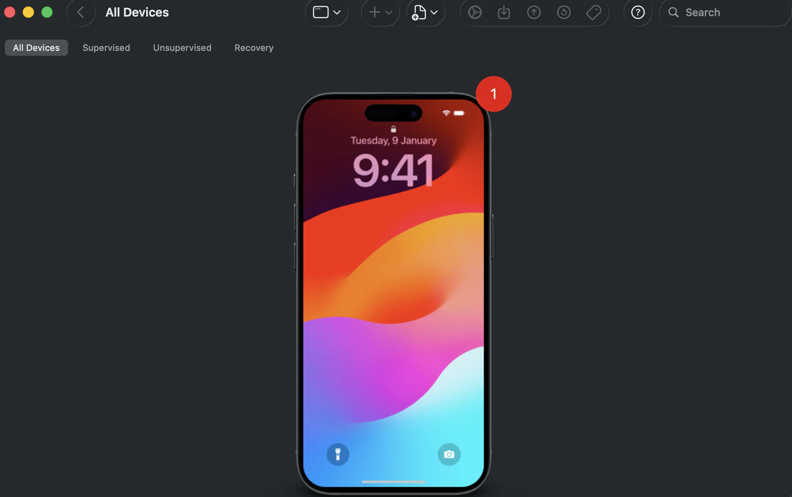
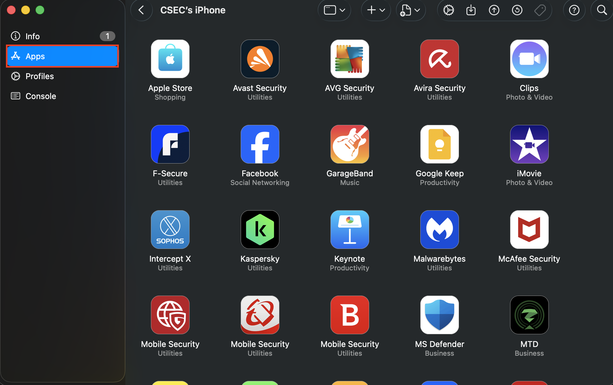
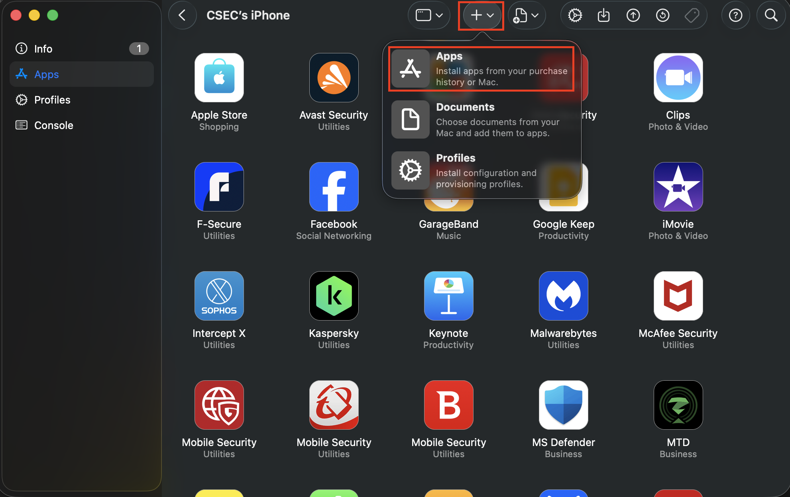
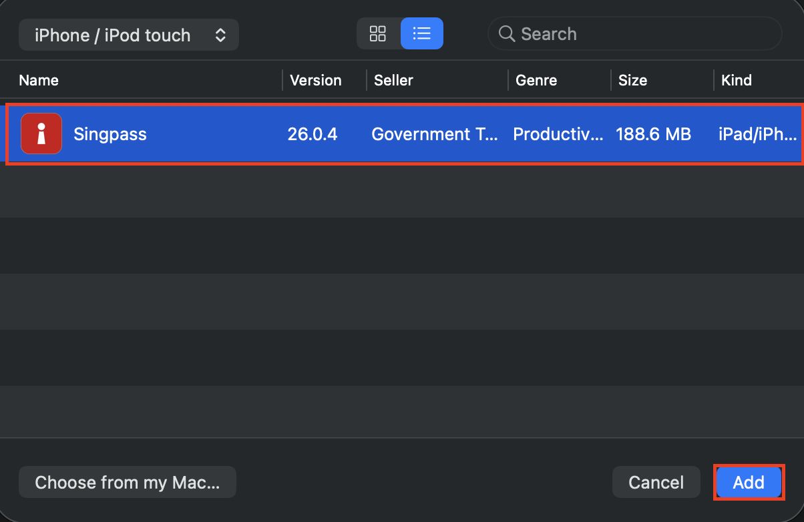
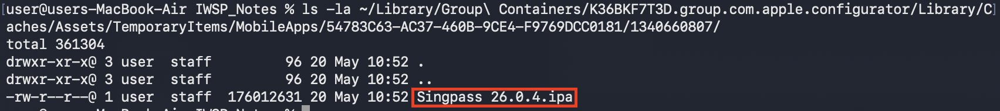

## platform-feature-01

### Description

The iOS platform provides IPA acquisition feature.

### Additional context

IPA acquisition is a feature that allows an IPA file to be obtained using Apple Configurator on macOS, enabling security testers to inspect the application's structure, configuration, permissions, and entitlements.

### Demonstration

Set up a physical iOS device with the following configuration:

| Configuration | Detail         |
| ------------- | -------------- |
| Device model  | iPhone 15      |
| iOS Version   | 17.6           |
| Device State  | Non-Jailbroken |
| App Used      | Singpass       |

Perform the following steps to enable IPA acquisition:

1. Sign in to the same Apple ID on both the physical iOS device and the macOS workstation. This ensures Apple Configurator can access the app licenses and deploy apps associated with the Apple ID.

2. On the macOS workstation, open Terminal and navigate to the Apple Configurator temporary cache directory (shown below). Keep this directory open so you can observe newly created files before the temporary cache is cleared.

``` shell
~/Library/Group\ Containers/K36BKF7T3D.group.com.apple.configurator/Library/Caches/Assets/TemporaryItems/MobileApps/
```

*Temporary Cache Directory*

3. Connect the iPhone to the macOS workstation and open Apple Configurator. Select the connected device, open the Apps tab, click Add, and search for the target app. Adding the app causes Apple Configurator to download the current production package from Apple's servers and temporarily store it in the local cache.



*Screenshot shows connect device on Apple Configurator*



*Screenshot shows `Apps` tab on connected device on Apple Configurator*



*Screenshot shows the selection of `+ > Apps` selection on Apple Configurator*



*Screenshot shows list of Apps on Apple Configurator*

4. Monitor the active cache subdirectory in Terminal for the newly created .ipa file. Once it appears, copy the file to your designated analysis workspace for static inspection and examination of its package structure.



*Screenshot shows Singpass app in the cache directory*

Because the iOS platform provides IPA acquisition feature, your app is at risk of:
- [platform-feature-01-risk-01](platform-feature-01-risk-01.md)
