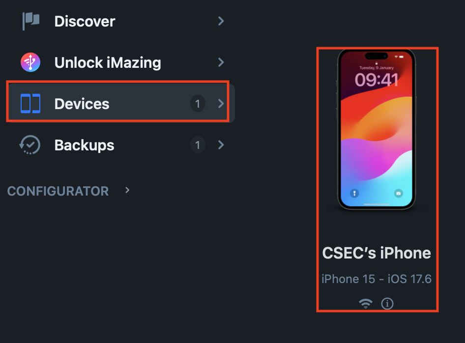

## platform-feature-01

### Description

The iOS platform provides IPA acquisition feature.

### Additional context

IPA acquisition is a feature that allows an IPA file to be obtained using [iMazing](https://imazing.com/guides/how-to-manage-apps-without-itunes?utm_medium=app) on macOS, enabling security testers to inspect the app's structure, configuration, permissions, and entitlements.

### Demonstration

Set up a physical iOS device with the following configuration:

| Configuration | Detail         |
| ------------- | -------------- |
| Device model  | iPhone 15      |
| iOS Version   | 17.6           |
| Device State  | Non-Jailbroken |
| App Used      | HealthHub      |

Perform the following steps to enable IPA acquisition:

1. Install and start iMazing. This gives you access to the tools required to manage apps on the connected iPhone and export IPA files.
2. Select `Devices`, and then select the connected iPhone. This displays the apps and management options for the selected device.

*Screenshot shows the list of connected iPhones under `Devices`.*

3. Select `Manage Apps`. This lists the apps installed on the connected iPhone and provides access to the installation and export options.

*Screenshot shows the tools provided by iMazing.*

4. Install the app that you intend to export. This ensures that iMazing can access the app package required for export. Note: wait for the installation to complete before you continue.

*Screenshot shows the `HealthHub` app selected for installation.*

5. Select the More Options (`...`) button on the bottom right of iMazing and select `Export .IPA`. This creates an IPA file from the selected app package.

*Screenshot shows the menu option to export the app as an IPA file.*

Because the iOS platform provides IPA acquisition feature, your app is at risk of:
- [platform-feature-01-risk-01](platform-feature-01-risk-01.md)
