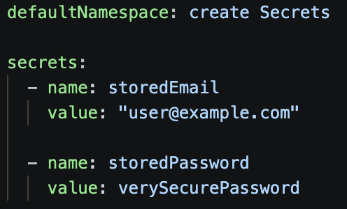
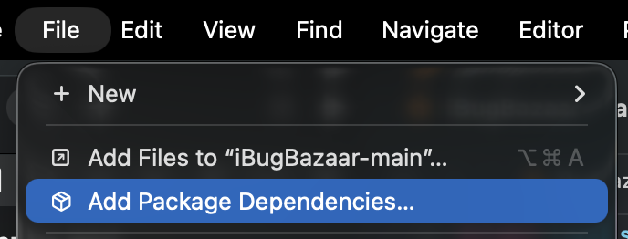
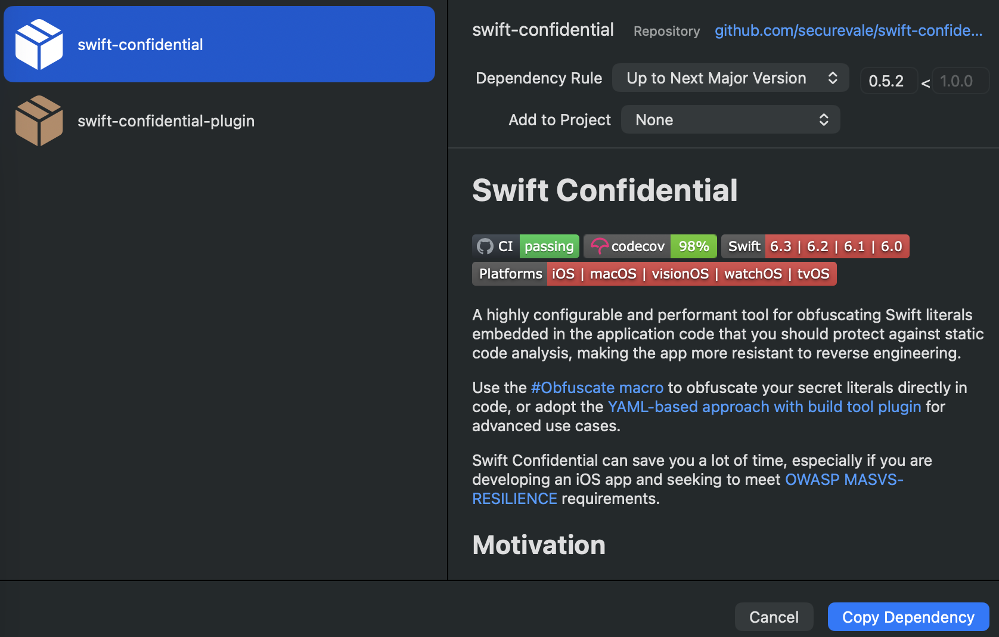
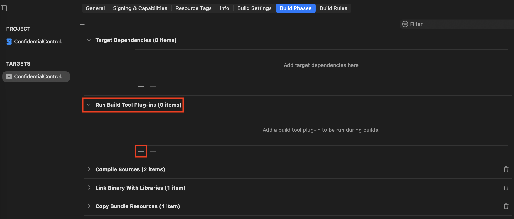
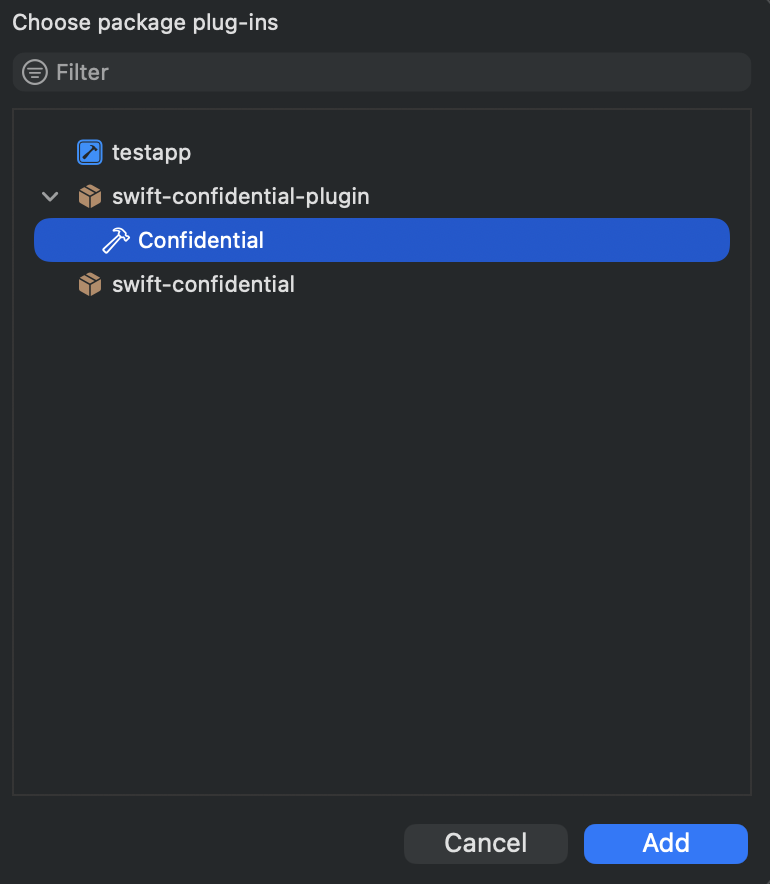
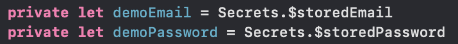

## platform-feature-01-risk-01-control-01

Your app can prevent the risk of an attacker analysing the application's IPA file by taking the following steps:

1. Prevent plaintext credential exposure by moving hardcoded Swift string literals, such as usernames and passwords, into a `confidential.yml` file instead of writing the credentials directly in the Swift source file (screenshot 1).



2. Prevent plaintext credentials from appearing directly in the compiled binary by adding the Swift Confidential packages to the Xcode project (screenshot 2 - 5) and processing `confidential.yml` with the Swift Confidential build plugin during the application build process.









3. Prevent easy static extraction of secret values by allowing Swift Confidential to generate obfuscated Swift code that reconstructs the secret values at runtime instead of leaving the original strings directly in the source file and compiled binary.

> ***Note**: The `confidential.yml` file should not be built into the app bundle.*

4. Prevent direct use of plaintext credentials in source code by updating the application code to reference the generated secret values, such as `Secrets.demoEmail` and `Secrets.demoPassword` (screenshot 6).



5. Prevent straightforward recovery of secret values by using Swift Confidential's build-time obfuscation and runtime deobfuscation process. Depending on the configuration, the plugin may use a random mix of `shuffle`, `encrypt`, `compress`, and `nonce` steps. `shuffle` rearranges bytes and stores obfuscated index metadata, `encrypt` encrypts secret bytes using AES-GCM or ChaChaPoly, `compress` compresses the data and hides compression magic bytes, and `nonce` uses a random number to hide or deobfuscate metadata such as keys, indexes, and magic bytes.

6. Prevent simple recovery of encrypted secret values by storing encryption keys as obfuscated key bytes and recovering them only at runtime by XORing the key bytes with nonce bytes. The formula used is shown below.

```
byte ^ nonceBytes[index % nonceByteWidth]
```

7. Detect remaining plaintext credential exposure by rebuilding the application, extracting the IPA, and checking the compiled binary using `strings` and static analysis tools to verify that the original plaintext credential values no longer appear directly in the binary.

8. Prevent remaining plaintext credential exposure by reviewing any values still found in the compiled binary, moving them into `confidential.yml`, updating the code to reference the generated secret values, and rebuilding the application until the plaintext values no longer appear in static analysis results.

> ***Note**: At runtime, the app must eventually reconstruct the plaintext value to compare it. Swift Confidential mainly protects against easy static extraction with tools like `strings`, but it does not stop a determined attacker from debugging the app, hooking the getter, dumping memory, or patching the login result.*

### References

- https://github.com/securevale/swift-confidential.git
- https://github.com/securevale/swift-confidential-plugin.git

The IPA with the implemented control can be found [here](implemented_controls/platform-feature-01-risk-01-control-01.zip).
