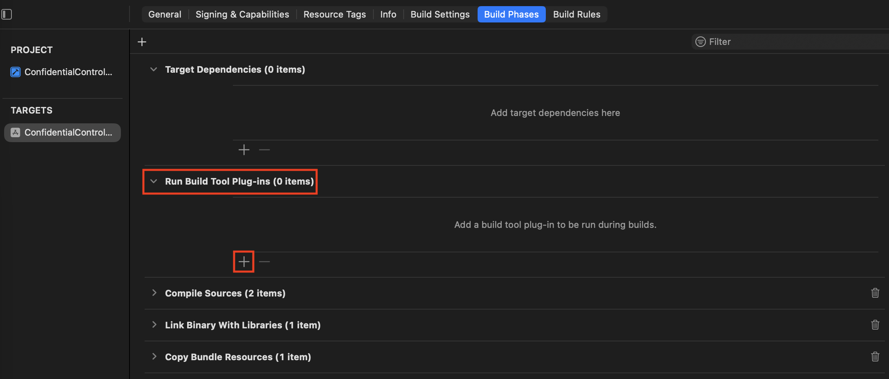
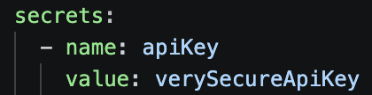
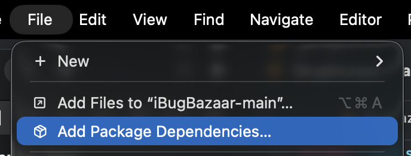
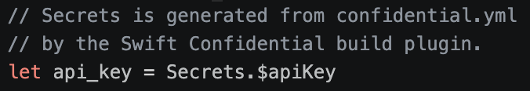

## platform-feature-01-risk-01-control-01

Your app can prevent the risk of an attacker analyzing the application's IPA file by taking the following steps:

1. Set up the Swift Confidential build plugin in Xcode. This allows the plugin to access the app's source code and replace plaintext literals with obfuscated code during the build.

> ***Note**: The `confidential.yml` file should not be built into the app bundle.*

2. Move plaintext literals to `confidential.yml`. This allows the plugin to generate obfuscated Swift accessors for those literals during the build.  

*Contents of confidential.yml*

3. Replace plaintext literals with the generated Swift accessors. This ensures that the app references the obfuscated accessors instead of the original plaintext literals.

4. Rebuild the application and use a static analysis tool, such as MobSF, to verify that the original plaintext literals are no longer easily recoverable from the .ipa file.

> ***Note**: At runtime, the app must eventually reconstruct the plaintext value to compare it. Swift Confidential mainly protects against easy static extraction with tools like `strings`, but it does not stop a determined attacker from debugging the app, hooking the getter, dumping memory, or patching the login result.*

### References

- https://github.com/securevale/swift-confidential.git
- https://github.com/securevale/swift-confidential-plugin.git

The IPA with the implemented control can be found [here](implemented_controls/platform-feature-01-risk-01-control-01.zip).
