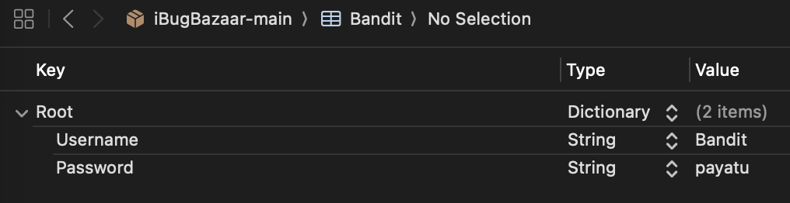
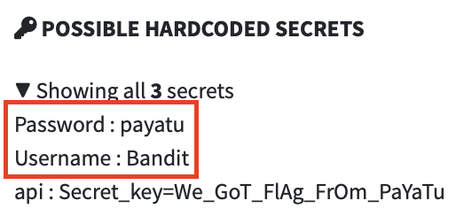
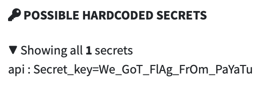
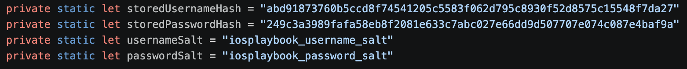
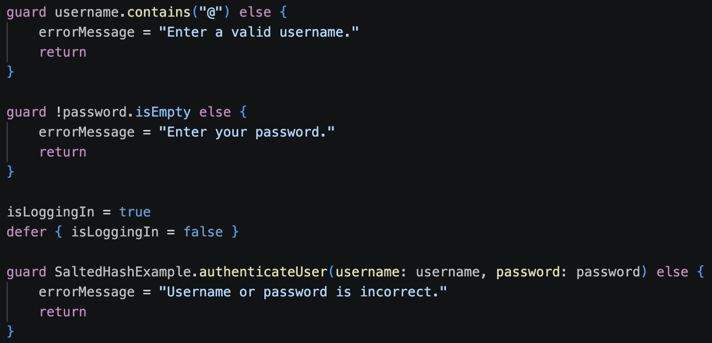
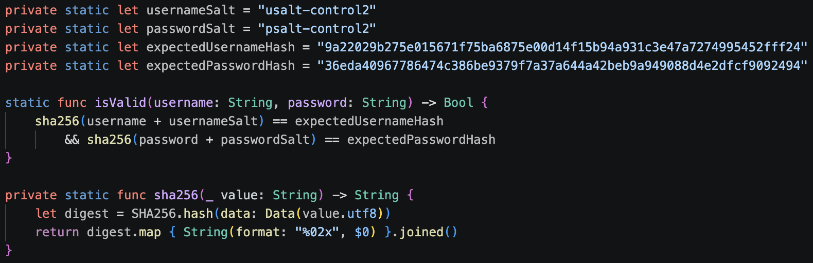

## platform-feature-01-risk-01-control-02

Your app can prevent the risk of an attacker analysing the application's IPA file by taking the following steps:

1. Prevent hardcoded credential exposure by removing plaintext credentials from bundled `.plist` files, because `.plist` files are packaged as application resources and can be extracted directly from the IPA using static analysis tools. In this implementation, `Bandit.plist`, which contained plaintext credentials, was removed from the app bundle (screenshot 1 - 3). Once removed, static analysis tools such as MobSF are unable to detect the plaintext credentials.

2. Prevent exposure of sensitive data such as hardcoded secrets by replacing plaintext credentials with salted hash values (screenshot 4) or moving authentication secrets to server-side logic instead of storing the original credential values directly in bundled application files. During authentication, the submitted username and password are combined with their respective salts and passed through the hashing function before comparison (screenshot 5 - 6).

3. Detect whether plaintext credentials are still exposed by rebuilding the IPA and scanning it with MobSF or reviewing IPA strings using static analysis tools.

4. Prevent remaining plaintext credential exposure by reviewing any sensitive values still detected by MobSF or IPA string analysis, removing them from bundled application resources, and rebuilding the IPA until the original plaintext credentials are no longer detected.

### References

The IPA with the implemented control can be found [here](implemented_controls/platform-feature-01-risk-01-control-02.zip).
