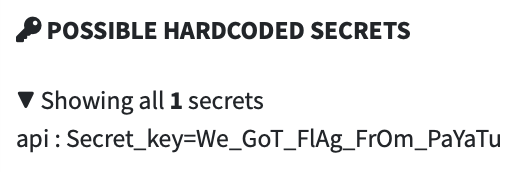
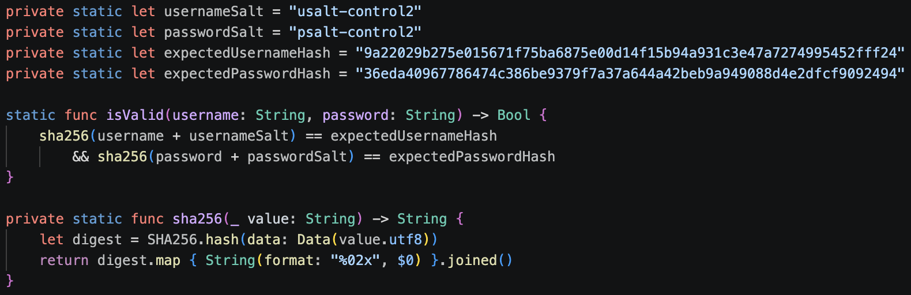

## platform-feature-01-risk-01-control-02

Your app can prevent the risk of an attacker analysing the app's IPA file by taking the following steps:

1. Remove plaintext literals from bundled `.plist` files as app resources can be extracted directly from the IPA using static analysis tools like MobSF. 

*Screenshot shows plaintext literals in a plist file*

*Screenshot shows plaintext literals extracted by MobSF*

2. Replace plaintext literals with salted hash values. During authentication, the submitted username and password are combined with their respective salts and passed through the hashing function before comparison.

*Screenshot shows username and password as local variables and their respective hashes*

*Screenshot shows function to validate user input*

3. After removal, run the IPA through MobSF again to check for exposed plaintext literals.

*Screenshot shows plaintext literals are no longer found by MobSF*

### References

The source code with the implemented control can be found [here](implemented_controls/platform-feature-01-risk-01-control-02.zip).
