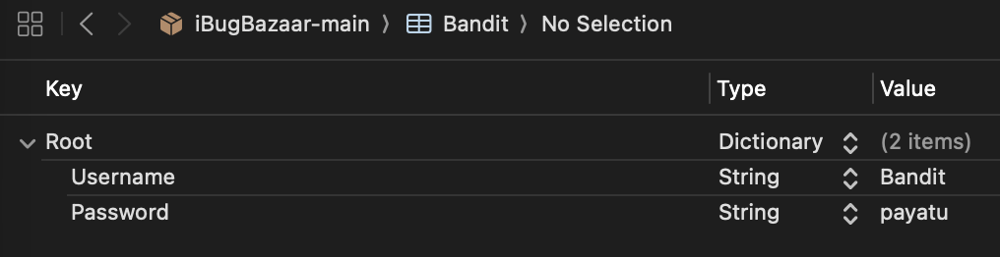
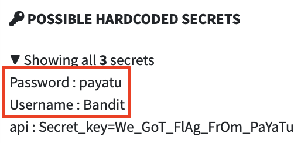

## platform-feature-01-risk-01-control-02

Your app can prevent the risk of an attacker analysing the app's IPA file by taking the following steps:

1. Remove plaintext literals from bundled `.plist` files as app resources can be extracted directly from the IPA using static analysis tools like MobSF. 



*Screenshot shows plaintext literals in a plist file*



*Screenshot shows plaintext literals extracted by MobSF*

2. Replace plaintext literals with salted hash values. During authentication, the submitted username and password are combined with their respective salts and passed through the hashing function before comparison.

``` swift
private static let storedUsernameHash = "abd91873760b5ccd8f74541205c5583f062d795c8930f52d8575c15548f7da27"
private static let storedPasswordHash = "249c3a3989fafa58eb8f2081e633c7abc027e66dd9d507707e074c087e4baf9a"

private static let usernameSalt = "iosplaybook_username_salt"
private static let passwordsalt = "iosplaybook_password_salt"
```

*Code block shows username and password as local variables and their respective hashes*

``` swift
private static let usernameSalt = "usalt-control2"
private static let passwordSalt = "psalt-control2"
private static let expectedUsernameHash = "9a22029b275e015671f75ba6875e00d14f15b94a931c3e47a7274995452fff24"
private static let expectedPasswordHash = "36eda40967786474c386be9379f7a37a644a42beb9a949088d4e2dfcf9092494"

static func isValid(username: String, password: String) -> Bool {
	sha256(username + usernameSalt) == expectedUsernameHash && sha256(password + passwordSalt) == expectedPasswordHash
}

private static func sha256(_ value: String) -> String {
	let digest = SHA256.hash(data: Data(value.utf8))
	return digest.map { String(format: "%02x", $0) }.joined()
}
```

*Code block shows function to validate user input*

3. After removal, run the IPA through MobSF again to check for exposed plaintext literals.


*Screenshot shows plaintext literals are no longer found by MobSF*

### References

The source code with the implemented control can be found [here](implemented_controls/platform-feature-01-risk-01-control-02.zip).
