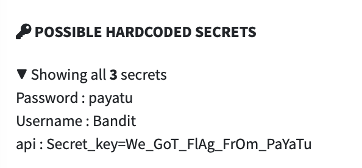

## platform-feature-01-risk-01

### Description

Because the iOS platform provides IPA acquisition feature, your application is at risk of an attacker analysing the application's IPA file.

### Goal

As a result, this could lead to _**Discovery**_ - attackers finding out the IPA's hardcoded secrets.

### Demonstration

Set up a workstation with the following configuration:

| Configuration | Detail |
| -------- | ------- |
| Prerequisite | platform-feature-01 |
| Workstation | Web browser installed |

Perform the following steps to demonstrate the risk of an attacker analysing the application's IPA file:

1. Set up Mobile Security Framework (MobSF) to perform static analysis on the `.ipa` file.

*Command to start MobSF:*

```shell
docker run -it --rm -p 8000:8000 opensecurity/mobile-security-framework-mobsf
```

2. Upload the `.ipa` file to MobSF and review the static analysis report for the app's overall security score, configuration issues, and sensitive information, such as hardcoded keys, embedded URLs, and other exposed data.



*Exposed credentials and api key*

Feature-01-Risk-01 control measures:

- [platform-feature-01-risk-01-control-01](platform-feature-01-risk-01-control-01.md)
- [platform-feature-01-risk-01-control-02](platform-feature-01-risk-01-control-02.md)

References:

- https://mas.owasp.org/MASTG/techniques/ios/MASTG-TECH-0058/
