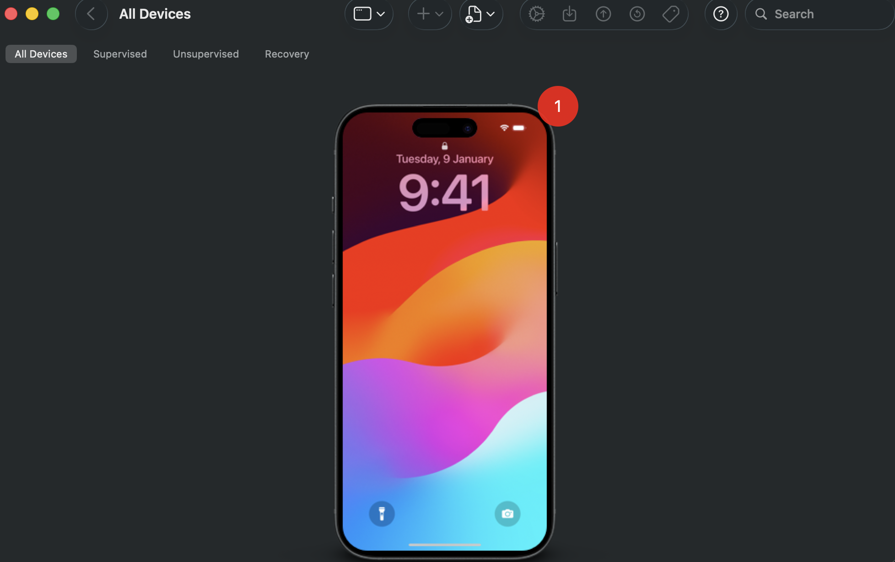
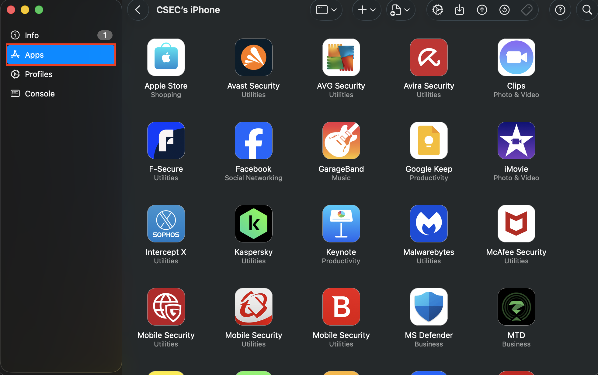
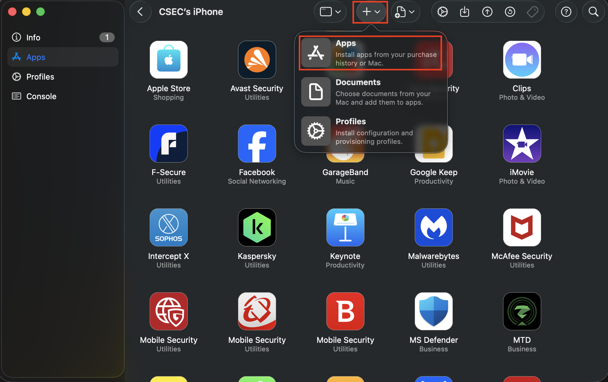
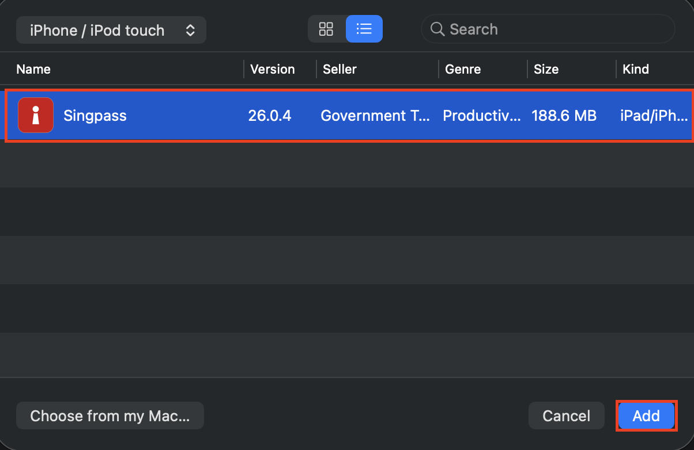
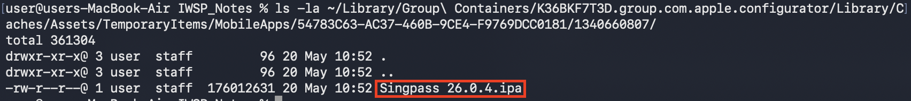

## platform-feature-01

### Description

The iOS platform provides IPA acquisition feature.

### Additional context

IPA acquisition is a feature that allows an IPA file to be obtained from Apple Configurator on macOS, enabling security testers to inspect the application's structure, configuration, permissions, and entitlements.

### Demonstration

Set up a physical iOS device with the following configuration:

| Configuration | Detail |
| -------- | ------- |
| Device model | iPhone 15 |
| iOS Version | 17.6 |
| Device State | Non-Jailbroken |
| App Used | Singpass v26.0.4 |

Perform the following steps to enable IPA acquisition:

1. Ensure the same AppleID is signed into both the physical iOS device and the macOS workstation to allow seamless application licensing and deployment access.

2. Open Terminal on the macOS workstation and navigate to the [Apple Configurator](https://apps.apple.com/au/app/apple-configurator/id1037126344?mt=12) temporary cache directory (shown below) to prepare for real-time file interception before the OS flushes the temporary storage.

```
~/Library/Group\ Containers/K36BKF7T3D.group.com.apple.configurator/Library/Caches/Assets/TemporaryItems/MobileApps/
```

3. Use Apple Configurator by connecting the iPhone, selecting your device, navigating to the Apps tab, clicking the "Add" button, and searching for the target application to force the utility to fetch the latest production package from Apple's servers and store it in the local workstation cache.









4. Inspect the active subfolder in the Terminal directory to see the newly generated .ipa file and copy it to your designated testing workspace for static inspection and structure analysis.



Because the iOS platform provides IPA acquisition feature, your app is at risk of:
- [platform-feature-01-risk-01](platform-feature-01-risk-01.md)
