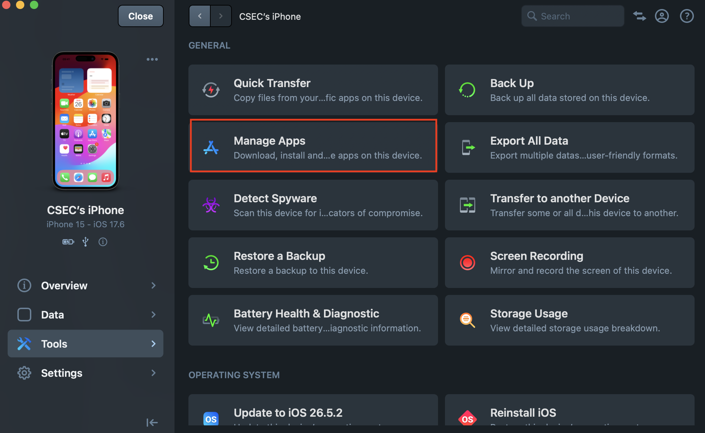
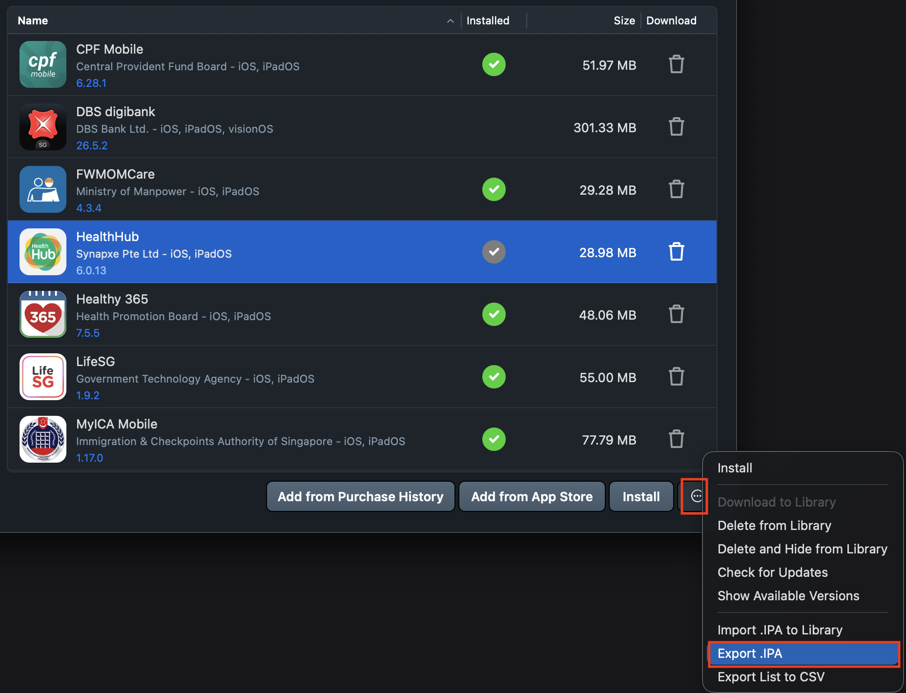

## platform-feature-01

### Description

The iOS platform provides IPA acquisition feature.

### Additional context

IPA acquisition is a feature that allows an IPA file to be obtained from [iMazing](https://imazing.com/guides/how-to-manage-apps-without-itunes?utm_medium=app) on macOS, enabling security testers to inspect the application's structure, configuration, permissions, and entitlements.

### Demonstration

Set up a physical iOS device with the following configuration:

| Configuration | Detail         |
| ------------- | -------------- |
| Device model  | iPhone 15      |
| iOS Version   | 17.6           |
| Device State  | Non-Jailbroken |
| App Used      | HealthHub      |

Perform the following steps to enable IPA acquisition:

1. Install and Open iMazing.
2. Select `Devices` and select your iPhone.

>*Select `Devices > CSEC's iPhone`*

5. Select `Manage Apps`.

>*Select `Manage Apps`*

6. Install the app that you want to export.

>*Install the app*

7. Select the **More Options** (`...`) button on the bottom right of the application and select `Export .IPA`.

>*Export the IPA*

Because the iOS platform provides IPA acquisition feature, your app is at risk of:
- [platform-feature-01-risk-01](platform-feature-01-risk-01.md)
