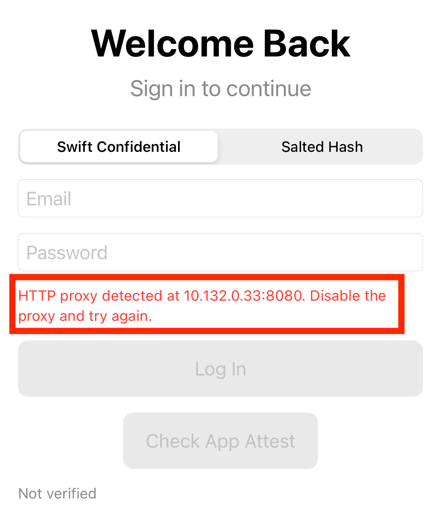

## platform-feature-02-risk-01-control-01

### Description

Detect HTTPs traffic proxying

### Demonstration
#### 01. Get iPhone proxy settings

Call `CFNetworkCopySystemProxySettings()` to retrieve the iPhone's current network proxy configuration. This allows the app to detect whether a proxy is configured.

``` swift
guard let settings = CFNetworkCopySystemProxySettings()?.takeRetainedValue() as? [String: Any] else {
	return nil
}
```
*Code block shows the source code calling `CFNetworkCopySystemProxySettings()` to retrieve the proxy configuration*

#### 02. Check if HTTPs traffic uses proxy

Inspect the returned settings and check whether `HTTPEnable`, `HTTPSEnable`, or `ProxyAutoConfigEnable` is set to 1. Checking all three settings ensures coverage for HTTP proxies, HTTPS proxies, and Proxy Auto-Configuration (PAC) scripts.

#### 03. Respond to detected proxy 

If any proxy setting is enabled, trigger an appropriate response. Display a warning to the user, log an alert, or stop the network request. Taking immediate action helps prevent sensitive data from passing through an unverified intermediary that could intercept or modify the traffic.

``` swift
guard settings[enabledKey] as? Int == 1 else{
	return nil	
}
```

*Code block shows source code for proxy configuration check*



*Screenshot shows warning to user that proxy is configured*

### References

- https://developer.apple.com/documentation/cfnetwork/cfnetworkcopysystemproxysettings()

The source code with the implemented control can be found [here](implemented_controls/platform-feature-02-risk-01-control-01.zip).