## platform-feature-02

### Description

Set up HTTPs proxy

### Additional Context

HTTP proxy configuration is a feature that allows network traffic from a physical iOS device to be routed through a tester-controlled proxy server, enabling authorised security testers to inspect HTTP requests and responses, observe backend endpoints, validate transport security behaviour, and identify sensitive data exposure during dynamic analysis. 

### Demonstration
#### 01. Prepare the environment

Set up the required environment with:
* A physical iPhone 15 running iOS 17.6
* A physical macOS workstation with a web browser
* A target app installed on the iPhone
* A Burp Suite instance running on the macOS workstation

#### 02. Allow iPhone to reach proxy

Connect the iPhone and the macOS workstation to the same Wi-Fi network. This allows the iPhone to reach the Burp Suite proxy listener running on the workstation. 

#### 03. Obtain proxy details for iPhone

Identify the IP address of the macOS workstation by running the following command in Terminal: `ipconfig getifaddr en0`. Use the returned IP address as the proxy server address on the iPhone.

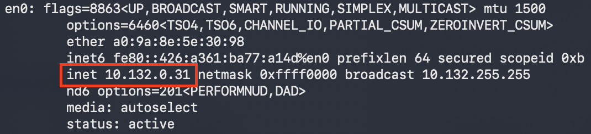

*Screenshot shows IP Address identified to be used for proxy*

#### 04. Configure Burp as proxy

Open Burp Suite on the macOS workstation. Go to `Settings > Tools > Proxy > Proxy listeners`. Edit the active listener or click `Add`. Set Bind to port to `8080`. Set Bind to IP to All interfaces, or select the Mac's local IP address. This configuration allows Burp Suite to accept network traffic from the iPhone.

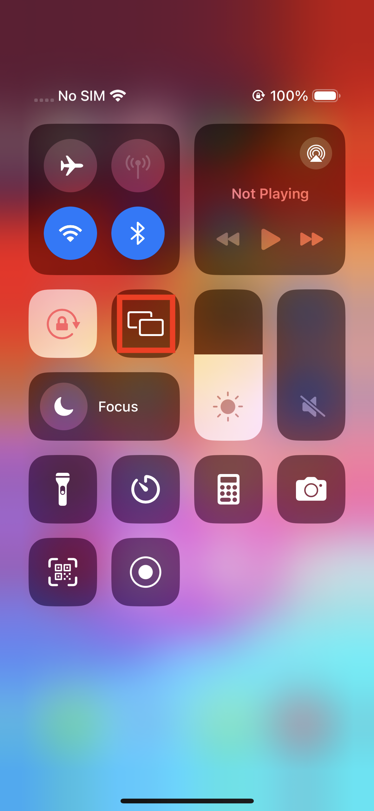

*Screenshot shows proxy listener set up on 10.132.0.31:8080*

#### 05. Route iPhone traffic through Burp

On the iPhone, go to `Settings > Wi-Fi` and tap the `(i)` icon next to the connected network. Select Configure `Proxy > Manual`. Enter the macOS workstation's IP address as the server and `8080` as the port. This configures the iPhone to route network traffic through the Burp Suite proxy.

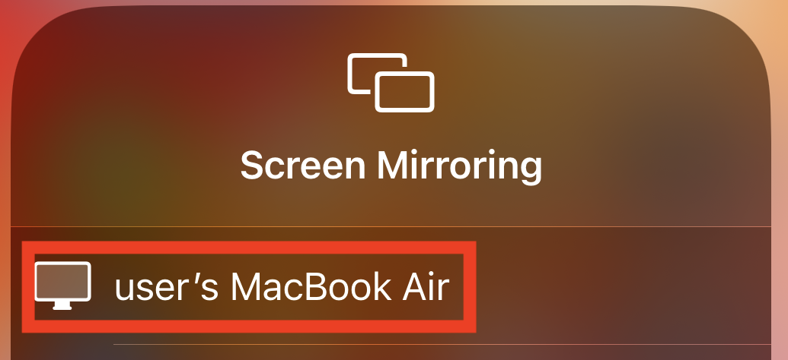

*Screenshot shows step1 of configuring a manual proxy*

*Screenshot shows step2 of configuring a manual proxy*

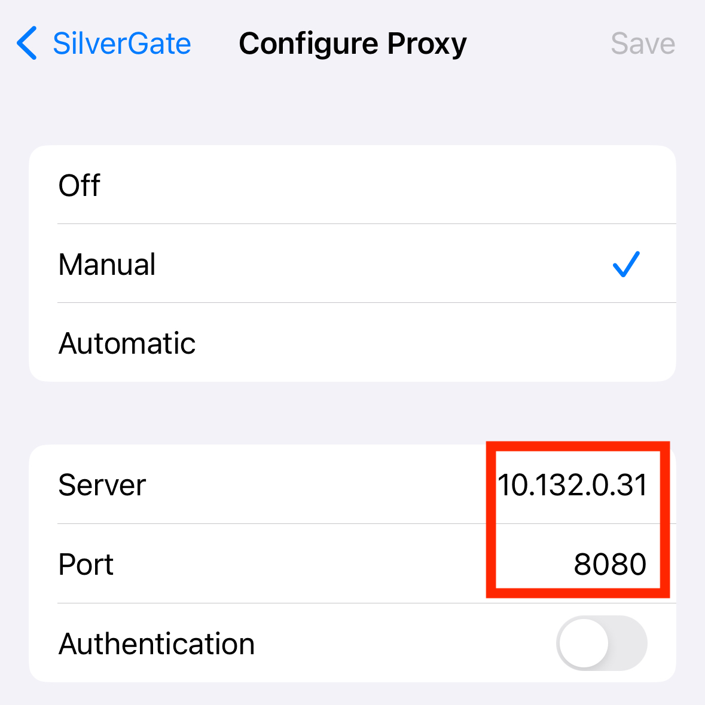

*Screenshot shows step3 of configuring a manual proxy*

#### 06. Get Burp cert for iPhone

Open a web browser on the iPhone and navigate to `http://burp/` while the Burp proxy is configured. Download the Burp Suite CA certificate. The certificate allows Burp Suite to inspect `HTTPS` traffic from applications that trust the installed CA certificate. Note: Apps that use certificate pinning may reject Burp's certificates and prevent `HTTPS` traffic inspection.

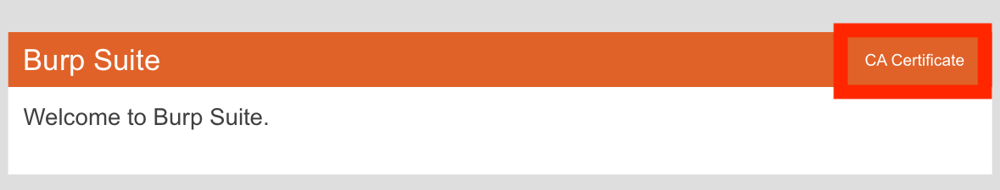

*Screenshot shows `http://burp` view and where to download burp's CA certificate*

#### 07. Add Burp cert to iPhone

On the iPhone, go to `Settings > Profile Downloaded` and install the Burp Suite CA certificate profile. Installing the profile adds the certificate to the device so the iPhone can recognise the Burp Suite CA.

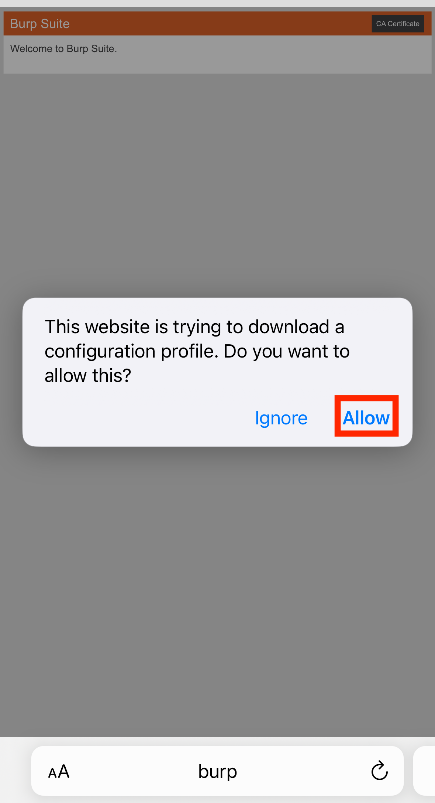

*Screenshot shows step1 of how to download and install the burp CA certificate profile*

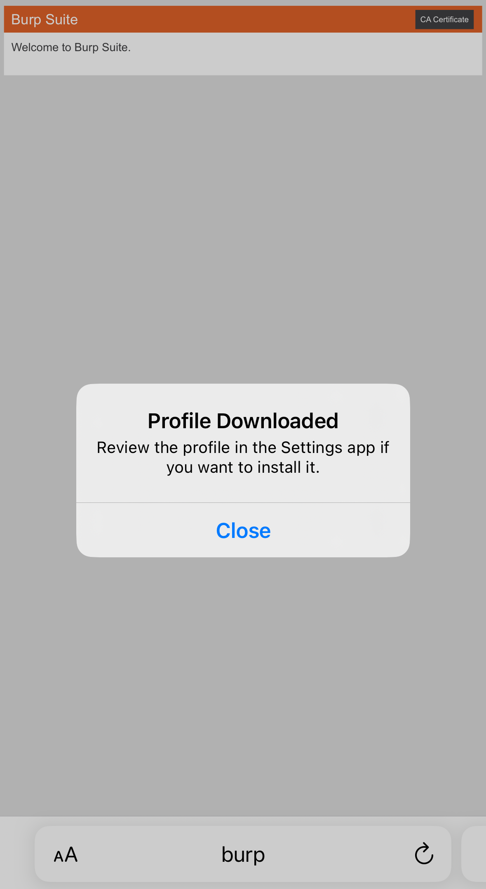

*Screenshot shows step2 of how to download and install the burp CA certificate profile*

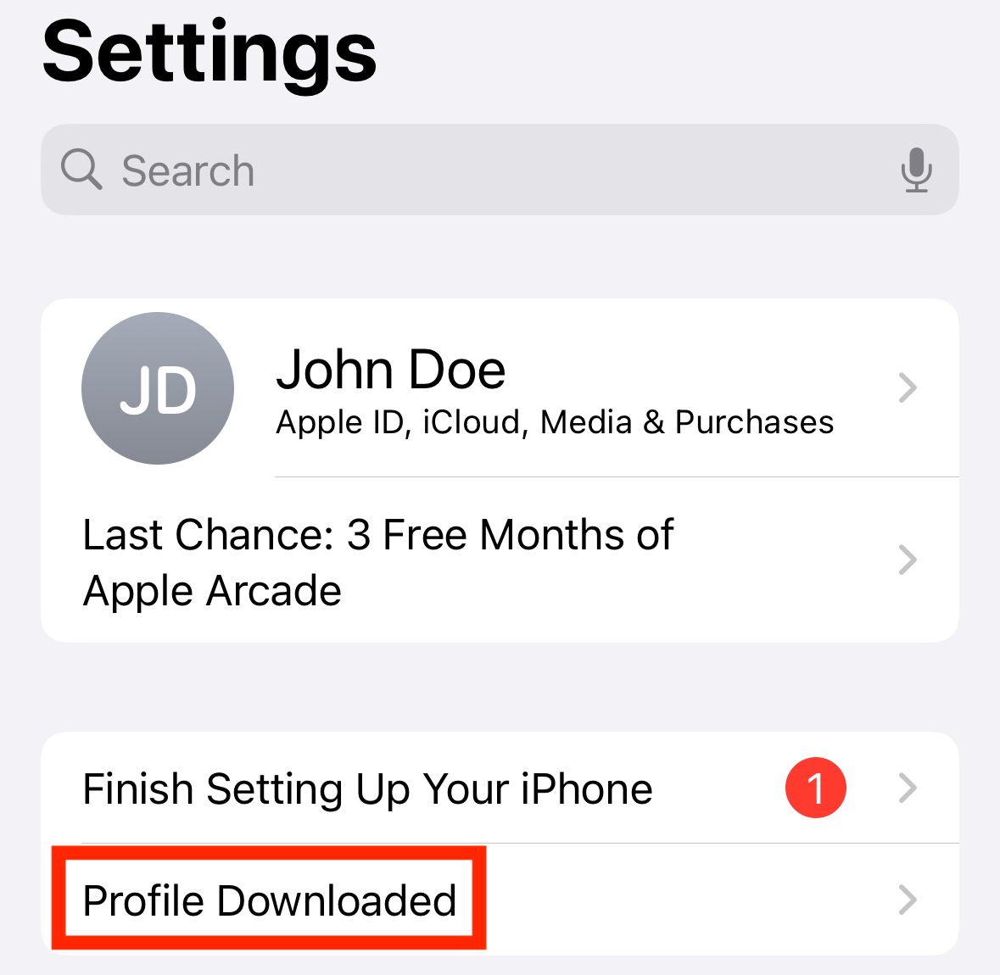

*Screenshot shows step3 of how to download and install the burp CA certificate profile*

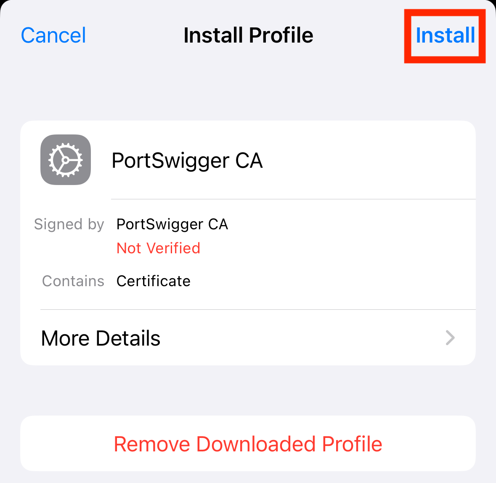

*Screenshot shows step4 of how to download and install the burp CA certificate profile*

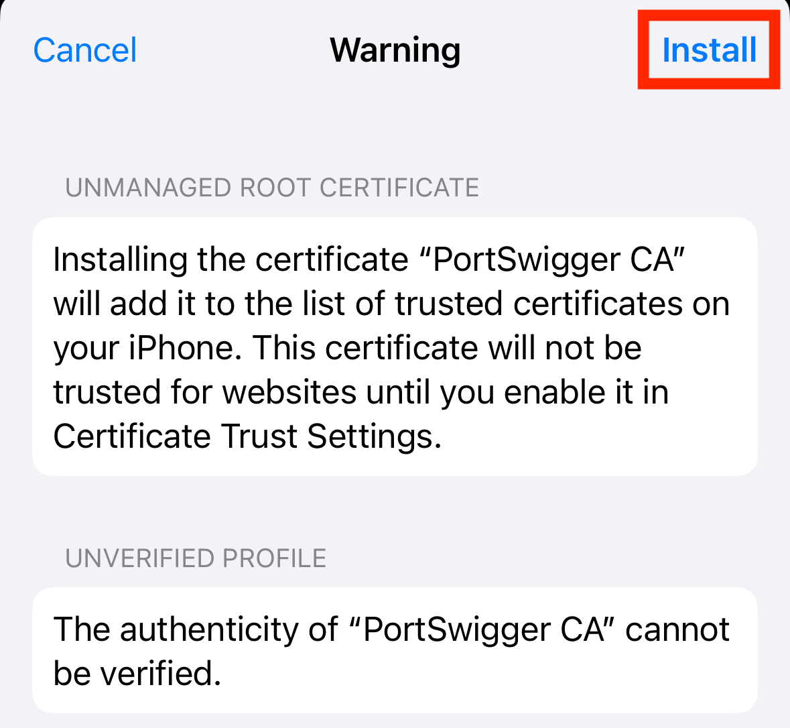

*Screenshot shows step5 of how to download and install the burp CA certificate profile*

#### 08. Allow iPhone to trust Burp

After installing the certificate profile, open `Settings > General > About > Certificate Trust Settings` and enable full trust for the Burp Suite CA certificate. This allows the iPhone to trust certificates issued by the Burp Suite CA during HTTPS traffic inspection.

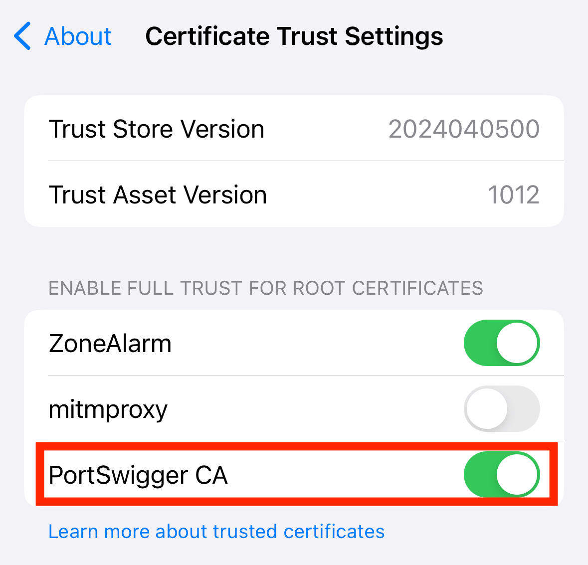

*Screenshot shows enable full trust for Burp's CA certificate*

Because the iOS platform provides HTTP Proxy Configuration feature, your app is at risk of:
- [platform-feature-02-risk-01](platform-feature-02-risk-01.md)
