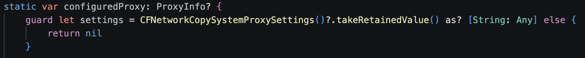

## platform-feature-03-risk-01-control-01

Your app can prevent the risk of an attacker capturing sensitive information displayed on the screen:

1. Replace standard `TextField` inputs for sensitive fields like `Password` with `SecureField`. This automatically prevents the password from showing up in screen recordings, screen shares, or screenshots.

*Screenshot shows implementation of `SecureField` on the `Password` input*

References:
- [https://medium.com/@lakshimi.cg/screenshot-prevention-in-ios-f059dc82b046](https://medium.com/@lakshimi.cg/screenshot-prevention-in-ios-f059dc82b046)

The source code with the implemented control can be found [here](implemented_controls/platform-feature-03-risk-01-control-01.zip).
