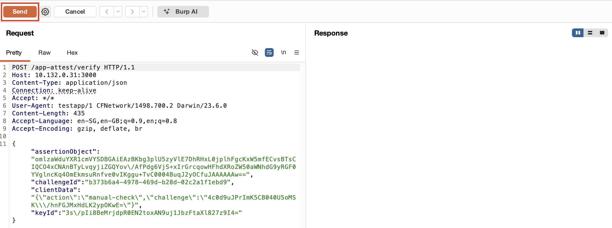

## platform-feature-03-risk-01

### Description

Because the iOS platform provides HTTP Proxy configuration feature, your application is at risk of an attacker monitoring data between applications.

### Goal

As a result, this could lead to ***Collection*** - attackers being able to monitor data between applications.

### Demonstration

Set up physical iOS device and macOS workstation with the following configuration:

| Configuration | Detail              |
| ------------- | ------------------- |
| Prerequisite  | platform-feature-03 |

Perform the following steps to demonstrate the risk of an attacker monitoring data between applications:

1. Launch the target app on the iPhone and navigate through its feature flows. In Burp Suite, open `Proxy > HTTP history` and ensure Intercept is turned off so the app runs smoothly. Verify that Burp Suite captures the app's `HTTP` and `HTTPS` traffic.

*Screenshot shows intercepted packet containing data*

Feature-03-Risk-01 Control Measures:
- [platform-feature-03-risk-01-control-01](platform-feature-03-risk-01-control-01.md)
