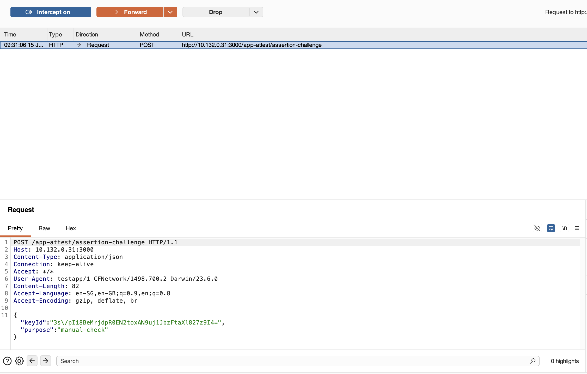
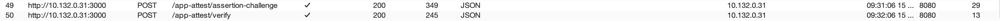

## platform-feature-03

### Description

The iOS platform provides HTTP proxy configuration feature.

### Additional Context

HTTP proxy configuration is a feature that allows network traffic from a physical iOS device to be routed through a tester-controlled proxy server, enabling authorised security testers to inspect HTTP requests and responses, observe backend endpoints, validate transport security behaviour, and identify sensitive data exposure during dynamic analysis. 

### Demonstration

Set up a physical iOS device with the following configuration:

| Configuration  | Detail         |
| -------------- | -------------- |
| Device Model   | iPhone 15      |
| iOS Version    | 17.6           |
| Device State   | Non-Jailbroken |
| Tools Required | `BurpSuite`    |

Perform the following steps to enable HTTP proxy:

1. Ensure the iPhone and macOS workstation are connected to the same Wi-Fi network so that the iPhone can reach the proxy listener (BurpSuite) running on the workstation. 

2. Identify the macOS workstation IP Address on the Wi-Fi network. This IP Address will be used as the proxy on BurpSuite.

```
ipconfig getifaddr en0
```


*Screenshot shows IP Address identified to be used for proxy*

3. Start BurpSuite on the macOS workstation and configure a proxy listener to accept traffic from the iPhone. Under `Settings > Tools > Proxy > Proxy listeners`, bind the proxy listener to the IP Address obtained from the previous step and select an available port such as `8080`.


*Screenshot shows proxy listener set up on 10.132.0.31:8080*

4. On the iPhone, setup a manual proxy so that traffic goes through the proxy server. Use the following values for the manual proxy:

| Field          | Value                                  |
| -------------- | -------------------------------------- |
| Server         | macOS workstation IP address           |
| Port           | Proxy listener port                    |
| Authentication | Disabled, unless explicitly configured |


*Screenshot shows step1 of configuring a manual proxy*


*Screenshot shows step2 of configuring a manual proxy*


*Screenshot shows step3 of configuring a manual proxy*

5. Launch the target application and perform normal user flows while monitoring the proxy tool’s intercept tab or HTTP history. The proxy should be able to capture and display traffic from the iPhone.



*Screenshot shows packet intercepted by BurpSuite from the iPhone*



*Screenshot shows HTTP history of the iPhone on BurpSuite*

Because the iOS platform provides HTTP Proxy Configuration feature, your app is at risk of:
- [platform-feature-03-risk-01](platform-feature-03-risk-01.md)
