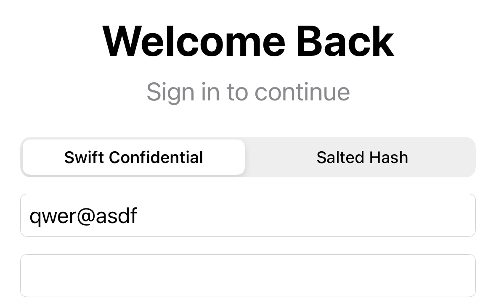
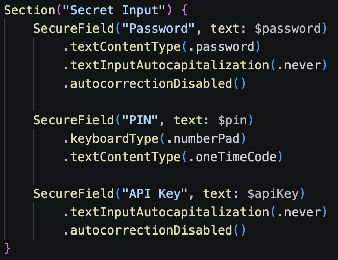

## platform-feature-04-risk-01-control-01

### Description

Protect sensitive text fields

### Demonstration
#### 01. Protect sensitive text fields

Replace standard `TextField` inputs for sensitive fields like Password with `SecureField`. This automatically forces iOS to use the default system keyboard, preventing custom third-party keyboards from capturing sensitive inputs.

*Screenshot shows regular input using a custom keyboard*

*Screenshot shows secret input being selected but the keyboard is not being shown due to the implementation of `SecureField`*

*Screenshot shows implementation of `SecureField`*

### References

- [https://developer.apple.com/library/archive/documentation/General/Conceptual/ExtensibilityPG/CustomKeyboard.html](https://developer.apple.com/library/archive/documentation/General/Conceptual/ExtensibilityPG/CustomKeyboard.html)

The source code with the implemented control can be found [here](implemented_controls/platform-feature-04-risk-01-control-01.zip).
