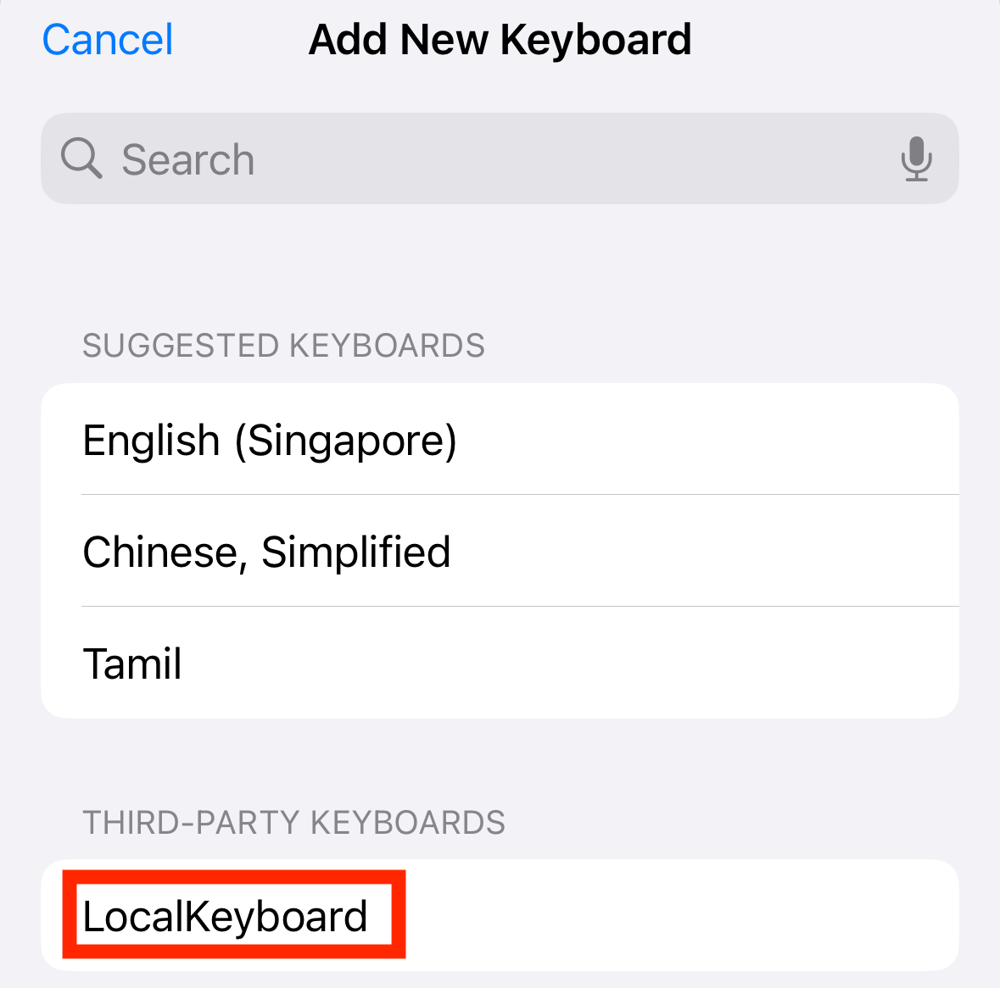
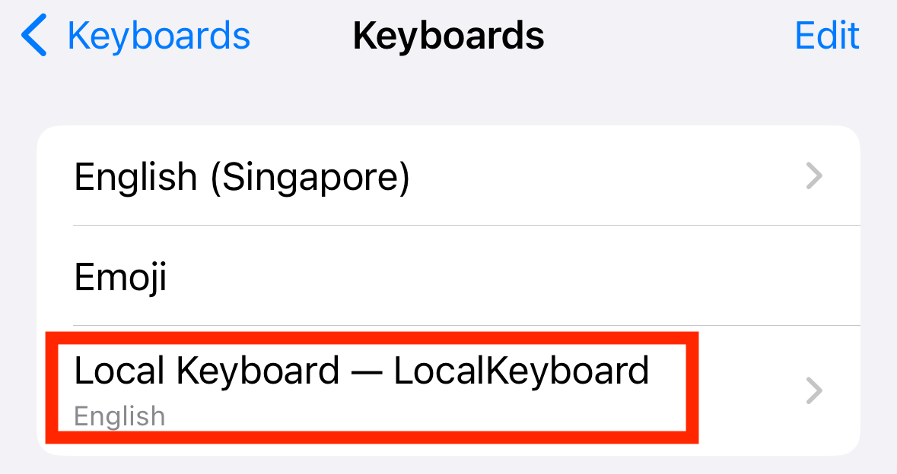
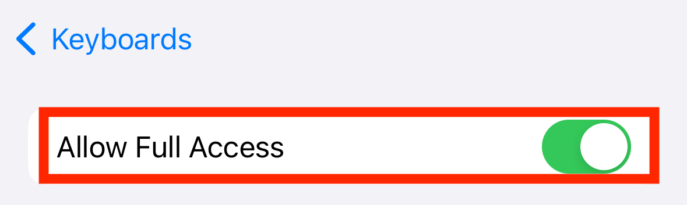

## platform-feature-04-risk-01

### Description

Capture text input

### Goal

As a result, this could lead to **_Collection_** - attackers capturing sensitive information entered by the user.

### Demonstration
#### 01. Prepare the environment

Set up the required environment with:
* A physical iPhone 15 running iOS 17.6
* A physical macOS workstation with Xcode
* A target app installed on the iPhone

#### 02. Install custom keyboard app

Install the custom keyboard app on the iPhone. Use Xcode to open the [feature4-localkeyboard](https://github.com/zhiyi-school/iosplaybook_sideload/tree/main/localkeyboard) project, then build and run the app on the iPhone.

``` swift
// Record each keystroke entered by the user
KeystrokeStore.append(text)
```

#### 03. Add custom keyboard to iPhone

Go to `Settings > General > Keyboard > Keyboards > Add New Keyboard`, then tap \[Keyboard Name] under Third-Party Keyboards. This enables the keyboard for use in apps.


*Screenshot shows step1 of adding a third-party keyboard*


*Screenshot shows step2 of adding a third-party keyboard*


*Screenshot shows step3 of adding a third-party keyboard*


*Screenshot shows step4 of adding a third-party keyboard*



*Screenshot shows step5 of adding a third-party keyboard*

#### 04. Give custom keyboard full access

In the Keyboards list, tap \[Keyboard Name], then enable Allow Full Access. This grants the permissions required for features such as custom themes and autocomplete.



*Screenshot shows how to access custom keyboard permissions*



*Screenshot shows enabling full access to custom keyboard*

#### 05. Switch to custom keyboard

Open the target app, tap any text field to open the keyboard, then press and hold the Globe 🌐 icon to select the custom keyboard. This activates the custom keyboard in the target app.


*Screenshot shows where to change to a custom keyboard*

#### 06. Check for captured text

Enter text into the target app using the custom keyboard, then return to the custom keyboard app to view the captured inputs. This verifies whether the custom keyboard can capture and retain text entered in the target app.


*Screenshot shows key strokes logged by the custom keyboard's app*

Feature-04-Risk-01 control measures:

- [platform-feature-04-risk-01-control-01](platform-feature-04-risk-01-control-01.md)
