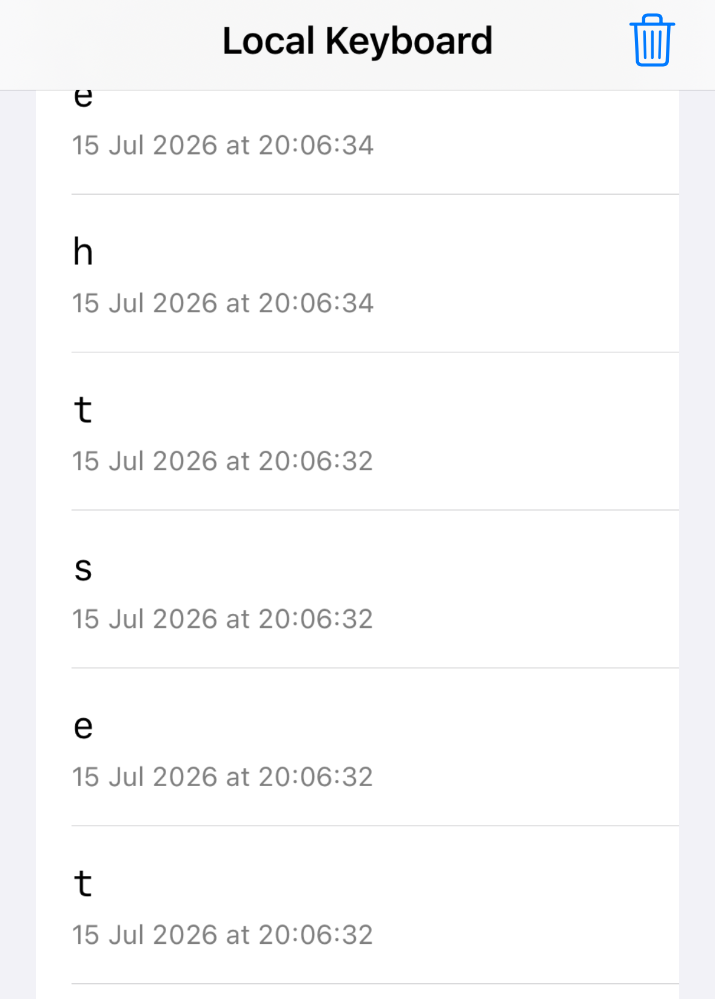

## platform-feature-04-risk-01

### Description

Because the iOS platform provides Custom Keyboard feature, your app is at risk of an attacker capturing user keystrokes through a malicious third-party keyboard.

### Goal

As a result, this could lead to **_Collection_** - attackers capturing sensitive information entered by the user.

### Demonstration

Set up a physical iOS device and macOS workstation with the following configuration:

| Configuration          | Detail                                                     |
| ---------------------- | ---------------------------------------------------------- |
| Prerequisite           | platform-feature-05                                        |
| Additional Requirement | User must add the custom keyboard and enable `Full Access` |

Perform the following steps to demonstrate the risk of an attacker capturing user keystrokes through a malicious third-party keyboard:

1. Install the app on the iPhone. Use Xcode to open the [feature5-local_keyboard](https://github.com/zhiyi-school/iosplaybook_sideload/tree/main/feature5) project, then build and run the app on the iPhone.

``` swift
// Record each keystroke entered by the user
KeystrokeStore.append(text)
```

2. Follow the setup steps under `platform-feature-05` to add the custom keyboard and grant the required permissions. This enables the custom keyboard for use in other apps.

3. Open the target app, tap any text field to open the keyboard, then press and hold the Globe 🌐 icon to select the custom keyboard. This activates the custom keyboard in the target app.


*Screenshot shows where to change to a custom keyboard*

4. Enter text into the target app using the custom keyboard, then return to the custom keyboard app to view the captured inputs. This verifies whether the custom keyboard can capture and retain text entered in the target app.



*Screenshot shows key strokes logged by the custom keyboard's app*

Feature-04-Risk-01 control measures:

- [platform-feature-04-risk-01-control-01](platform-feature-04-risk-01-control-01.md)
