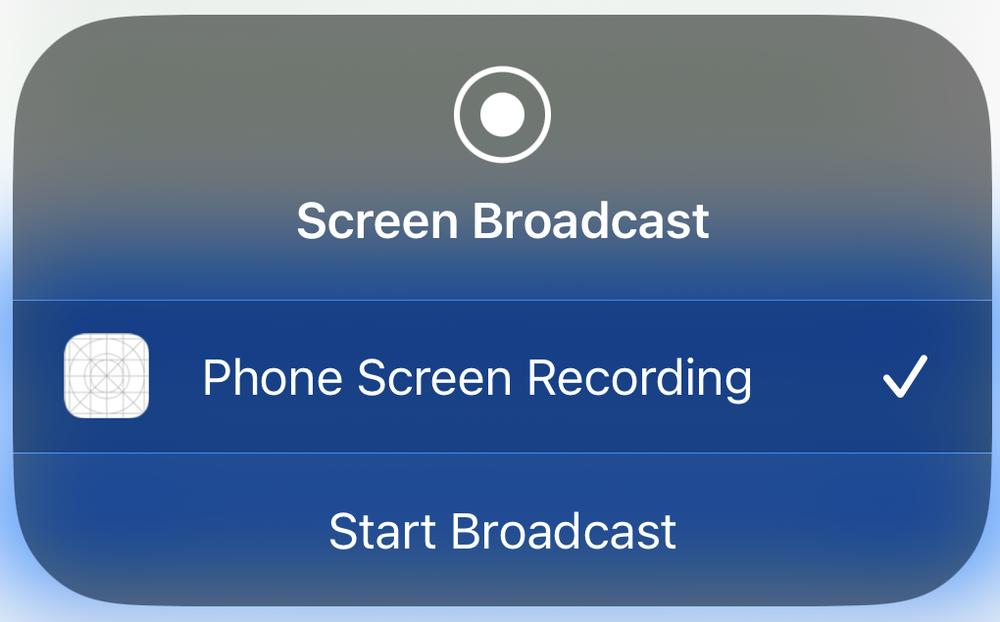
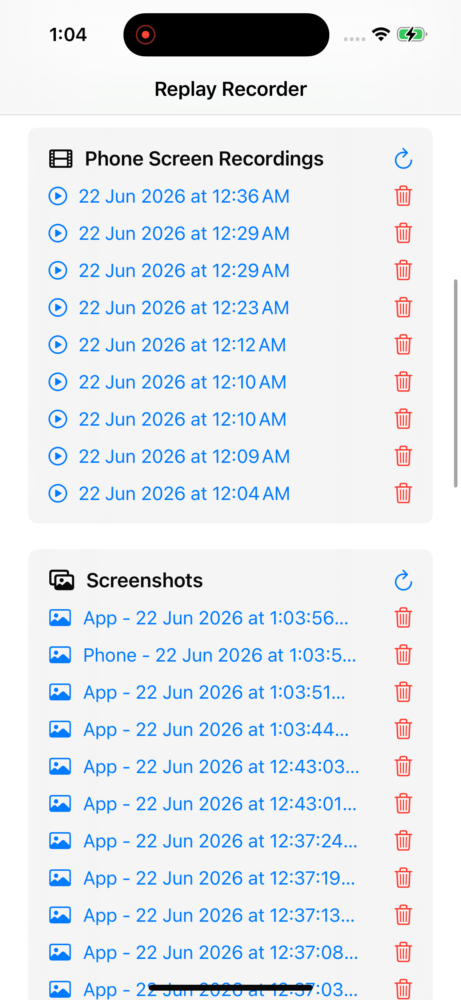

## platform-feature-04-risk-01

### Description

Because the iOS platform provides screen capture feature, your app is at risk of an attacker an attacker capturing sensitive information displayed on the screen.

### Goal

As a result, this could lead to ***Collection*** - attackers capturing sensitive information displayed on screen.

### Demonstration

Set up physical iOS device and macOS workstation with the following configuration:

| Configuration | Detail                             |
| ------------- | ---------------------------------- |
| Prerequisite  | platform-feature-04                |
| Malicious App | `feature4-replay_consent_recorder` |

Perform the following steps to demonstrate the risk of an attacker capturing sensitive information displayed on the screen:

1. Install the malicious app on the iPhone. In this example, use the `feature4-replay_consent_recorder` package. Download and open the [feature4-replay_consent_recorder](https://github.com/zhiyi-school/iosplaybook_sideload/tree/main/feature4) project in Xcode. Build and run the app on the iPhone. This app provides the test environment for evaluating how sensitive information behaves during screen recording.

2. Enter information into any app's interface. This provides content that you can observe during screen recording. If the app does not protect sensitive information correctly, the recorded content may expose that information.

*Screenshot shows visible username and blanked out password fields when both fields are filled*

3. On the malicious app, tap on "`Start App Screen Recording`" to start the screen recording. The malicious app can automatically take screenshots during the screen recording even when it is moved to the background, potentially exposing sensitive information shown on screen. 

*Screenshot shows notification from the app of the last screenshot saved*

4. Start screen recording when prompted. The screen recording feature displays a system popup and requires the user to press the `Start Broadcast` button before recording begins.

*Screenshot shows screen mirroring popup*

5. The captured images and videos are stored in the app container instead of the local Photos album and remain persistent even when the app is force closed. This allows malicious actors to capture sensitive information outside of the malicious app. 

*Screenshot shows list of screen recording and screenshots taken by the malicious app*

Feature-04-Risk-01 Control Measures:
- [Platform_Feature-04-Risk-01-Control-01](Platform_Feature-04-Risk-01-Control-01.md)
