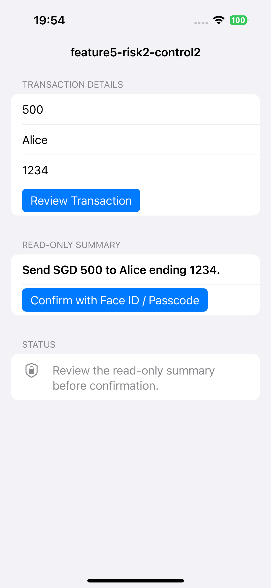
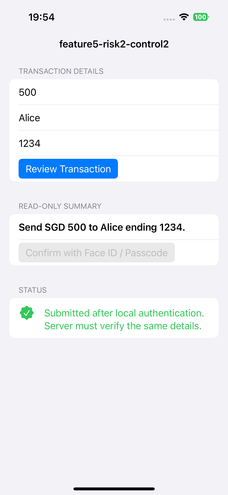

## platform-feature-04-risk-02-control-02

Your app can prevent the risk of an attacker sending remote input through a malicious third-party keyboard connected to a command server by taking the following steps:

1. Require the user to submit a separate manual confirmation step for sensitive actions by showing a read-only confirmation summary before the action is completed. This can prevent automatic submission of potential payloads.

*Screenshot shows confirmation step requiring user to manually tap a button to submit.  Information the user wants to submit is also shown*

2.  step-up authentication using Face ID, Touch ID, or passcode-backed local authentication before final submission. This ensures that the user understands what is being submitted and prevents multiple auto form submissions.

*Screenshot shows approved submission after Face ID authentication*

### References

- [https://developer.apple.com/documentation/localauthentication/accessing-keychain-items-with-face-id-or-touch-id](https://developer.apple.com/documentation/localauthentication/accessing-keychain-items-with-face-id-or-touch-id)
- [https://developer.apple.com/documentation/localauthentication/logging-a-user-into-your-app-with-face-id-or-touch-id](https://developer.apple.com/documentation/localauthentication/logging-a-user-into-your-app-with-face-id-or-touch-id)

The source code with the implemented control can be found [here](implemented_controls/platform-feature-05-risk-02-control-02.zip).
