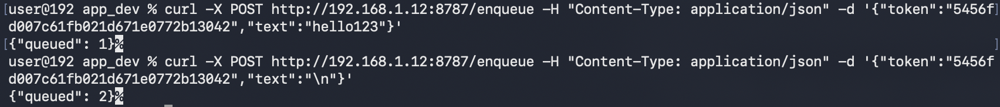

## platform-feature-04-risk-02

### Description

Because the iOS platform provides Custom Keyboard feature, your app is at risk of an attacker sending remote input through a malicious third-party keyboard connected to a command server.

### Goal

As a result, this could lead to **_Command and Control_** - attackers remotely controlling input sent through the custom keyboard.

### Demonstration

Set up a physical iOS device and macOS workstation with the following configuration:

| Configuration          | Detail                                                       |
| ---------------------- | ------------------------------------------------------------ |
| Prerequisite           | platform-feature-05                                          |
| Additional Requirement | User must add the custom keyboard and enable `Full Access`   |
| Network Requirement    | iOS device and macOS workstation must be on the same network |

Perform the following steps to demonstrate the risk of an attacker sending remote input through a malicious third-party keyboard connected to a command server:

1. Start the malicious app's server on the macOS workstation. Ensure that the iOS device is connected to the same network as the macOS workstation so that the iOS device is able to communicate with the malicious app's server.

2. Launch the malicious app on the iOS device. If the server is reachable on the same network, the server returns a token to the app and pairs with it automatically.

3. Send remote keystroke inputs from the server using `curl` commands to queue the key strokes on the server. 

*Screenshot shows the queued remote keystroke inputs on the server*

4. Open the custom keyboard on the iOS device. The custom keyboard polls the `/next` API on the malicious app's server for queued input. If there are items in the queue, the keyboard automatically executes the queued keystrokes in the focused text field. Note: For `RETURN`, queue the string "`\n`" separately for it to work as a Go/Search action. If `\n` is queued together with the payload, it will be treated as an empty space character.

Feature-05-Risk-02 control measures:

- [platform-feature-04-risk-02-control-01_(deprioritise)](platform-feature-04-risk-02-control-01_(deprioritise).md)
- [platform-feature-04-risk-02-control-02_(deprioritise)](platform-feature-04-risk-02-control-02_(deprioritise).md)
