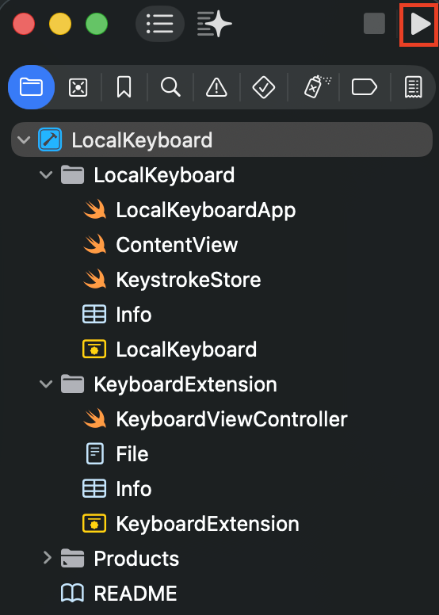

## platform-feature-04
### Description

The iOS platform provides screen capture feature.

### Additional Context

Screen capture and screen mirroring allow the device screen to be captured or displayed on another device through screenshots, screen recording, or AirPlay screen mirroring. This may expose sensitive information shown on the screen, such as usernames, email addresses, or other personal identifiable information.

### Demonstration

Set up a physical iOS device with the following configuration:

| Configuration | Detail         |
| ------------- | -------------- |
| Device Model  | iPhone 15      |
| iOS Version   | 17.6           |
| Device State  | Non-Jailbroken |

Perform the following steps to enable screen capture:

1. On the macOS workstation, open `System Settings` and search for `AirPlay Receiver`. Turn `Airplay Receiver` on and under `Allow AirPlay for`, select `Everyone`. This setting enables the `AirPlay`. 

*Screenshot shows the correct setting configured for Airplay*

2. On the iPhone, navigate to the `Control Centre` and select `Screen Mirroring`. Select the macOS workstation to begin screen mirroring.

*Screenshot highlights the screen mirroring icon*

*Screenshot shows list of targets for screen mirroring*

3. Open the target app on the iPhone. Perform one of the following actions to capture the screen:

| Action           | Method                                                |
| ---------------- | ----------------------------------------------------- |
| Screenshot       | Press `Volume Up` and `Power` button at the same time |
| Screen Recording | Start recording from `Control Centre`                 |
| Screen Mirroring | Select the receiver device from `Screen Mirroring`    |

Because the iOS platform provides Screenshot feature, your app is at risk of:
- [platform-feature-04-risk-01](platform-feature-04-risk-01.md)
