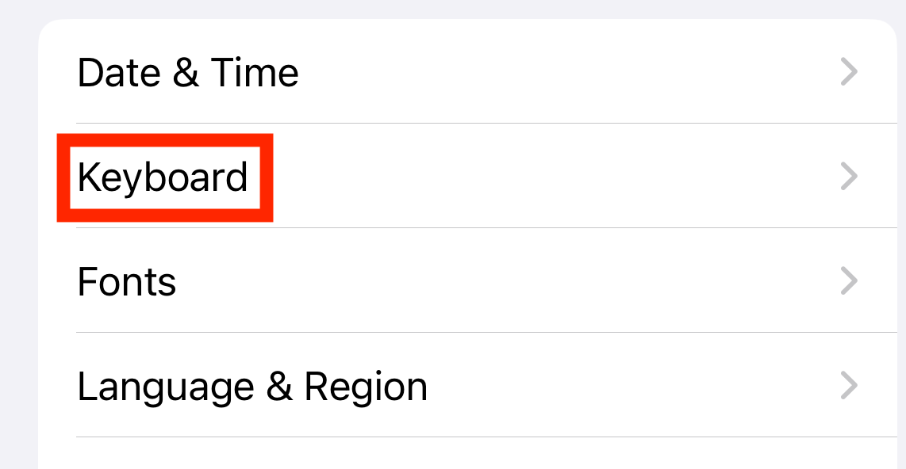
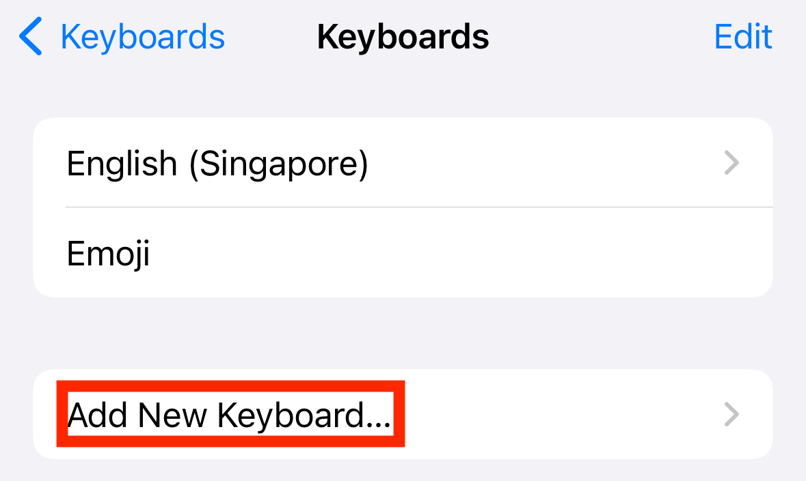
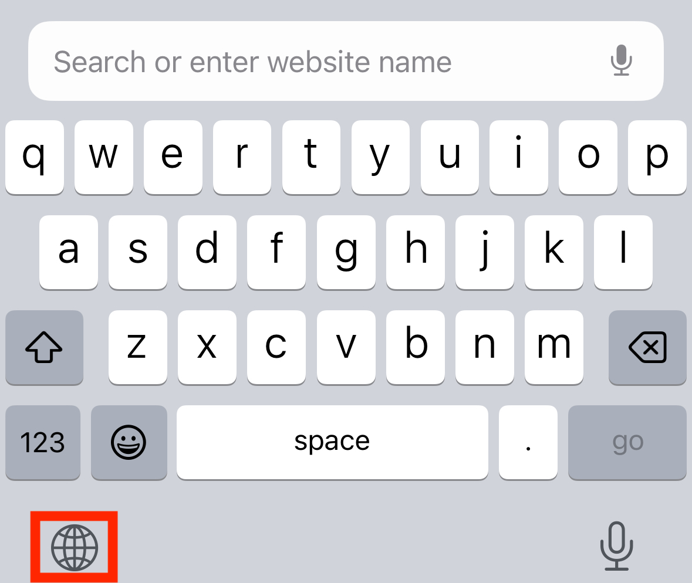

## platform-feature-04

### Description

Install custom keyboard app

### Additional context

Custom Keyboard is a feature that allows users to install and use third-party keyboards from an app, select them for text input across supported apps, and grant additional access when Allow Full Access is enabled.

### Demonstration
#### 01. Prepare the environment

Set up the required environment with:
* A physical iPhone 15 running iOS 17.6
* A target app installed on the iPhone

#### 02. Install custom keyboard app

Download and install a keyboard app like `Gboard` on the iPhone. This provides the third-party keyboard for the test.

#### 03. Add custom keyboard to iPhone

Go to `Settings > General > Keyboard > Keyboards > Add New Keyboard`, then tap \[Keyboard Name] under Third-Party Keyboards. This enables the keyboard for use in apps.

*Screenshot shows step1 of adding a third-party keyboard*

*Screenshot shows step2 of adding a third-party keyboard*

*Screenshot shows step3 of adding a third-party keyboard*

*Screenshot shows step4 of adding a third-party keyboard*

*Screenshot shows step5 of adding a third-party keyboard*

#### 04. Give custom keyboard full access

In the Keyboards list, tap \[Keyboard Name], then enable Allow Full Access. This grants the permissions required for features such as custom themes and autocomplete.

*Screenshot shows how to access custom keyboard permissions*

*Screenshot shows enabling full access to custom keyboard*

#### 05. Switch to custom keyboard

Open the target app, tap any text field to open the keyboard, then press and hold the Globe 🌐 icon to select the custom keyboard. This activates the custom keyboard in the target app.

*Screenshot shows where to change to a custom keyboard*

Because the iOS platform provides Custom Keyboard feature, your app is at risk of:

- [platform-feature-04-risk-01](platform-feature-04-risk-01.md)
- [platform-feature-04-risk-02_(deprioritise)](platform-feature-04-risk-02_(deprioritise).md)
