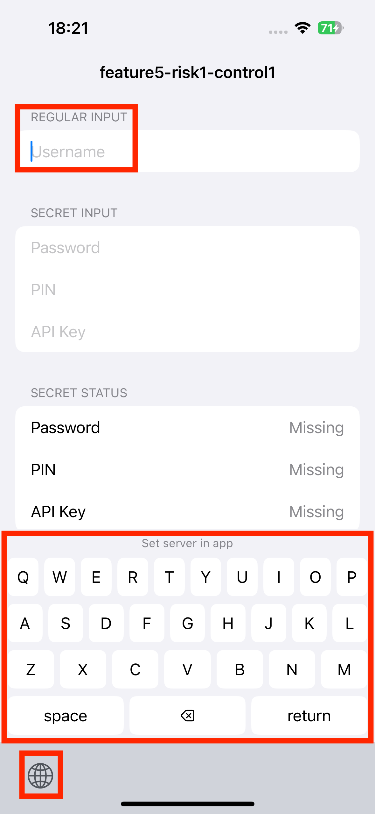
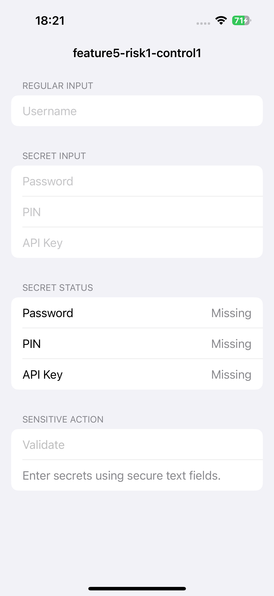
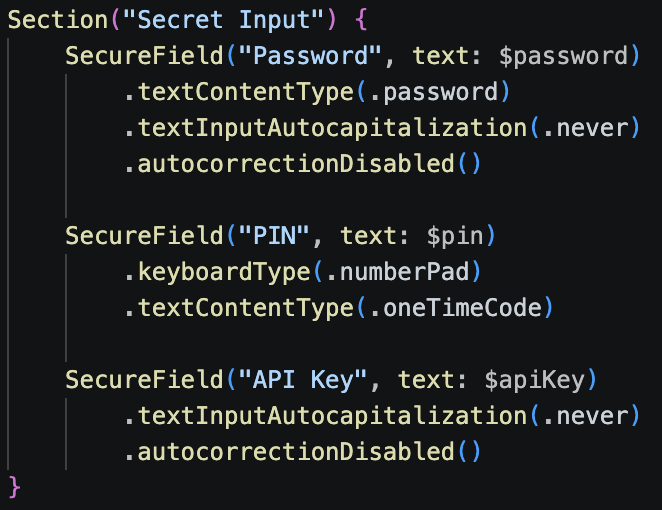

## platform-feature-05-risk-01-control-01

Your app can prevent the risk of an attacker capturing user keystrokes through a malicious third-party keyboard by taking the following steps:

1. Prevent third-party custom keyboards from capturing true secrets by using secure text entry for sensitive fields such as passwords, PINs, recovery phrases, backup codes, API keys, private keys, payment secrets, and administrative secrets. Apple documents that custom keyboards are not eligible to type into secure text input objects. When a user taps a secure text field, iOS temporarily replaces the custom keyboard with the system keyboard.

2. Detect where custom keyboards can still be used by reviewing regular text input fields, because non-sensitive fields can still use third-party keyboards and allow users to switch keyboards from the bottom-left keyboard selector (screenshot 1).

3. Prevent custom keyboard usage on sensitive fields by implementing `SecureField` for password, PIN, API key, and other secret input fields (screenshot 2 - 3). For numeric secrets such as PINs, use `SecureField` together with `.keyboardType(.numberPad)`. Disable unnecessary input features such as auto-capitalisation and autocorrect so that sensitive input is not modified, suggested, or exposed through keyboard behaviour. In this implementation, when the password field is selected, the third-party custom keyboard does not appear because the field uses secure text entry.

### References

- [https://developer.apple.com/library/archive/documentation/General/Conceptual/ExtensibilityPG/CustomKeyboard.html](https://developer.apple.com/library/archive/documentation/General/Conceptual/ExtensibilityPG/CustomKeyboard.html)

The IPA with the implemented control can be found [here](implemented_controls/platform-feature-05-risk-01-control-01.zip).
