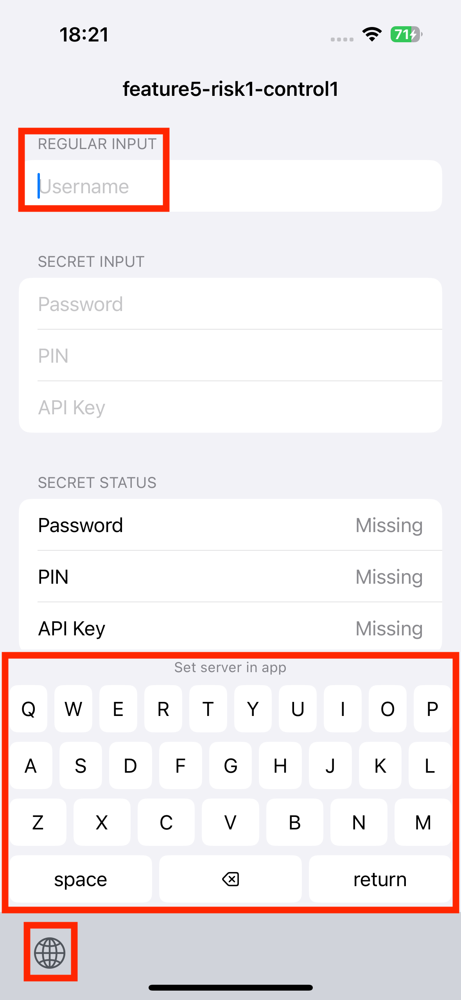
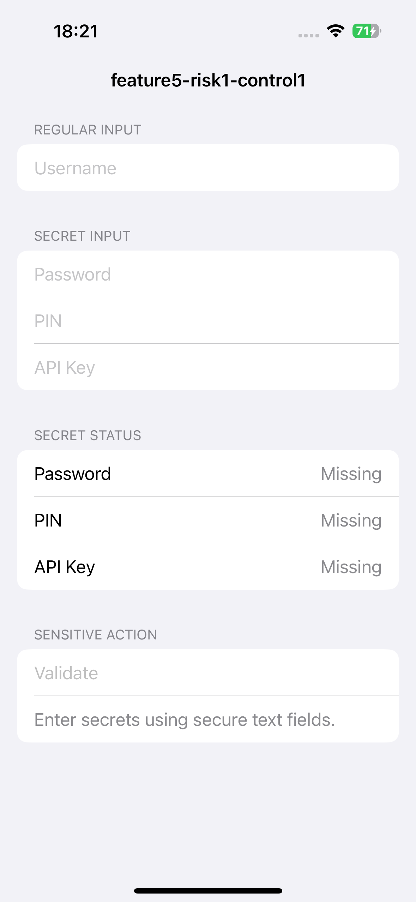

## platform-feature-05-risk-01-control-01

Your app can prevent the risk of an attacker capturing user keystrokes through a malicious third-party keyboard by taking the following steps:

1. Implementing `SecureField` for sensitive fields such as passwords, payment secrets, etc. Custom keyboards are not eligible to type into secure text input objects. When a user taps a secure text field, iOS replaces the custom keyboard with the system keyboard.

*Screenshot shows regular input using a custom keyboard*

*Screenshot shows secret input being selected but the keyboard is not being shown due to the implementation of `SecureField`*

*Screenshot shows implementation of `SecureField`*

### References

- [https://developer.apple.com/library/archive/documentation/General/Conceptual/ExtensibilityPG/CustomKeyboard.html](https://developer.apple.com/library/archive/documentation/General/Conceptual/ExtensibilityPG/CustomKeyboard.html)

The source code with the implemented control can be found [here](implemented_controls/platform-feature-05-risk-01-control-01.zip).
