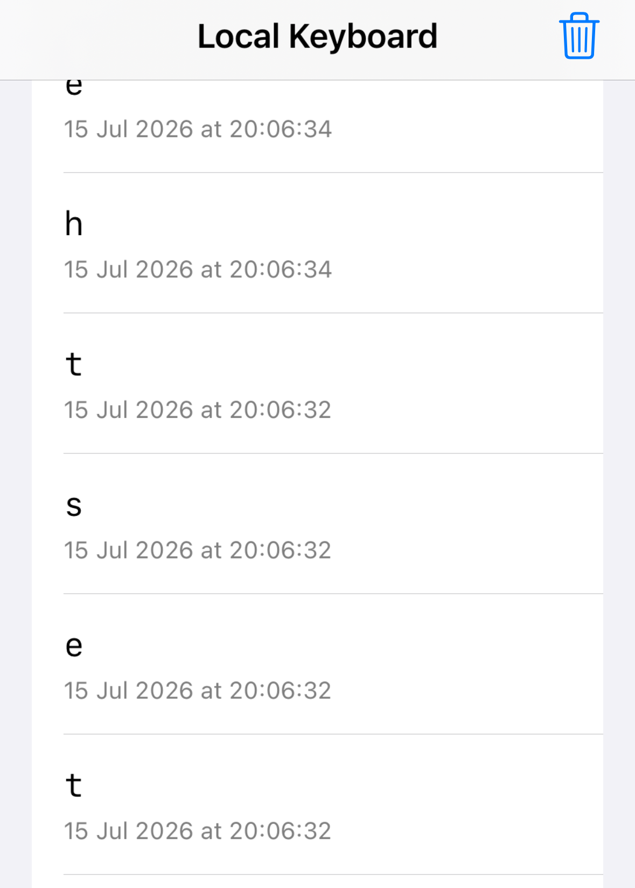

## platform-feature-05-risk-01

### Description

Because the iOS platform provides Custom Keyboard feature, your application is at risk of an attacker capturing user keystrokes through a malicious third-party keyboard.

### Goal

As a result, this could lead to **_Collection_** - attackers capturing sensitive information entered by the user.

### Demonstration

Set up a physical iOS device and macOS workstation with the following configuration:

| Configuration          | Detail                                                       |
| ---------------------- | ------------------------------------------------------------ |
| Prerequisite           | platform-feature-05                                          |
| Additional Requirement | User must add the custom keyboard and enable **Full Access** |

Perform the following steps to demonstrate the risk of an attacker capturing user keystrokes through a malicious third-party keyboard:

1. Open an application that accepts text input and switch to the custom keyboard to allow the custom keyboard to observe keys typed through it. Enter sample text using the custom keyboard to record the keystrokes inside the application container.

2. Review the stored keystroke logs inside the application container to verify that the custom keyboard acted as a keylogger (screenshot 1). This demonstrates how a malicious keyboard, disguised as a normal keyboard skin or utility keyboard, could collect sensitive user input if the user adds it and grants the required access.

Feature-05-Risk-01 control measures:

- [platform-feature-05-risk-01-control-01](platform-feature-05-risk-01-control-01.md)
