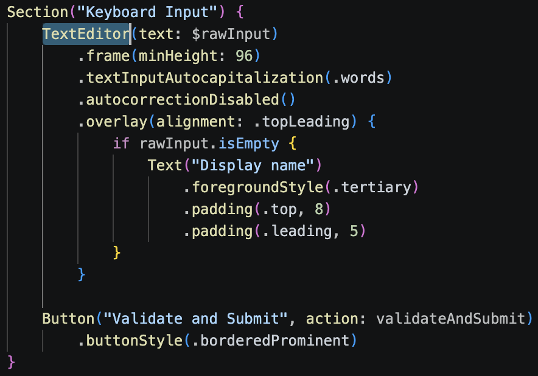
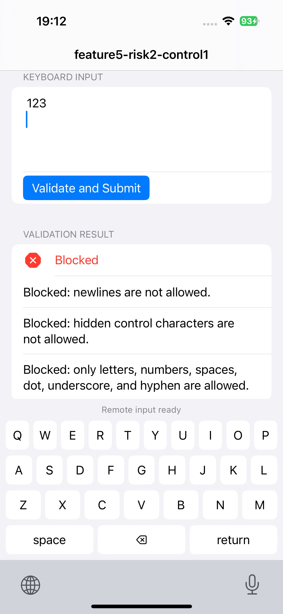
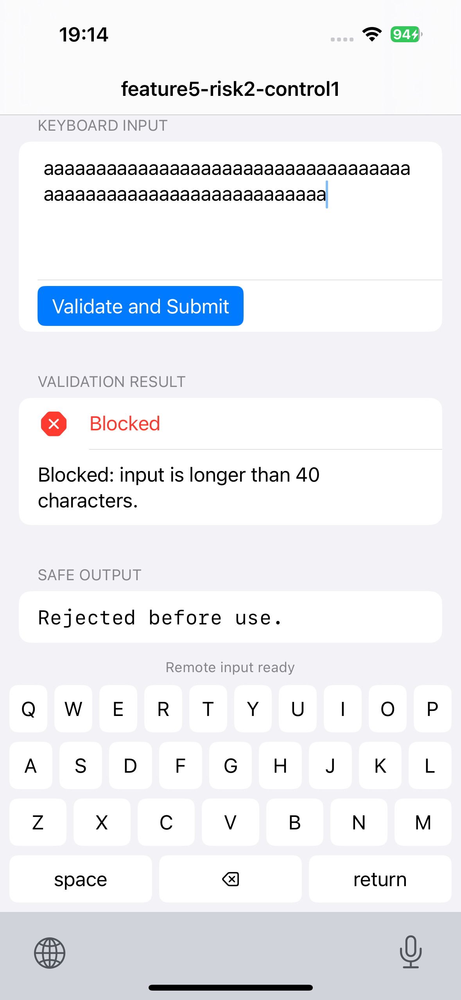

## platform-feature-05-risk-02-control-01

Your app can prevent the risk of an attacker sending remote input through a malicious third-party keyboard connected to a command server by taking the following steps:

1. Prevent attacker-controlled keyboard input from being trusted directly by treating all keyboard-supplied text as untrusted input. The application should validate, normalise, length-limit, and safely encode text before use. This includes enforcing length limits, character allowlists, Unicode normalisation, newline rejection, server-side validation, output encoding, and checks for hidden command-style input.

2. Prevent automatic or hidden submission of malicious input by using a `TextEditor` for keyboard-supplied text and requiring the user to manually tap the submit button before the text is processed. This prevents payloads such as `\n` from triggering automatic submission when inserted by a malicious keyboard or remote keyboard input source.

3. Detect unsafe keyboard-supplied input by checking the submitted text for disallowed characters, oversized payloads, command-like strings, hidden/control characters, newline-triggered submission attempts, and other unexpected input patterns.

4. Prevent unsafe input from being processed by rejecting or sanitising invalid values before they are used by the application or sent to the backend. Text fields should not support hidden commands, magic prefixes, newline-triggered submission, or direct execution of typed content.

### References

The IPA with the implemented control can be found [here](implemented_controls/platform-feature-05-risk-02-control-01.zip).
