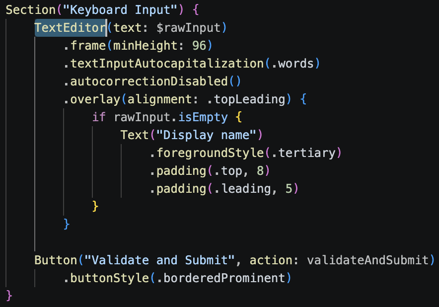
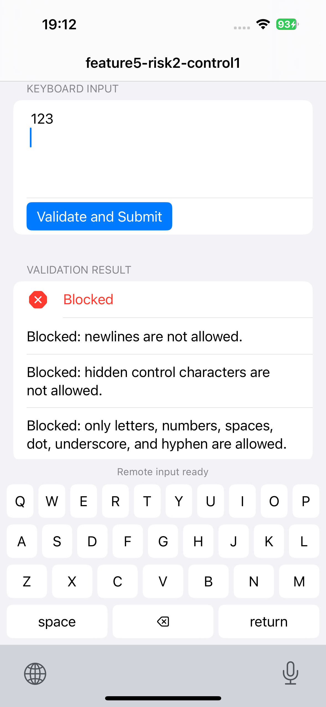
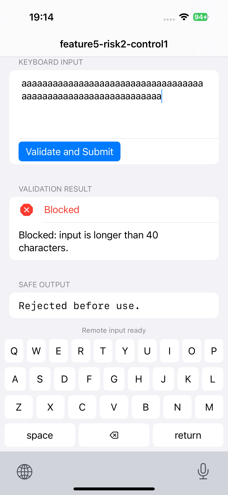

## platform-feature-05-risk-02-control-01

Your app can prevent the risk of an attacker sending remote input through a malicious third-party keyboard connected to a command server by taking the following steps:

1. Treat all keyboard-supplied text as untrusted input. The app should validate, normalise, length-limit, and safely encode text before use to prevent malicious payloads from being submitted.

2. Implement `TextEditor` instance for keyboard-supplied text, requiring users to manually tap the submit button before the text to be submitted. This prevents payloads such as `\n` from triggering automatically when inserted by a malicious keyboard or remote keyboard input source.

*Screenshot shows `TextEditor` instance implementation*

3. Validate submitted text for unexpected input patterns to prevent submissions of potentially malicious payloads.

*Screenshot shows validation for the special and hidden characters*

*Screenshot shows the validation for length of input string*

*Screenshot shows validation for command like strings*

### References

The source code with the implemented control can be found [here](implemented_controls/platform-feature-05-risk-02-control-01.zip).
