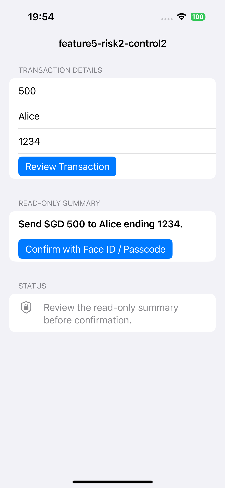
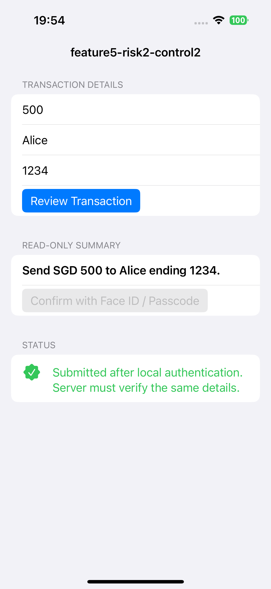

## platform-feature-05-risk-02-control-02

Your app can prevent the risk of an attacker sending remote input through a malicious third-party keyboard connected to a command server by taking the following steps:

1. Prevent keyboard-inserted text from being enough to complete a high-risk operation by requiring a separate manual submission step for sensitive actions, such as bank transfers, payment approvals, recipient changes, account updates, or administrative actions.

2. Prevent unauthorised or unintended submission by dismissing the keyboard after the user enters the transaction details and showing a read-only confirmation summary before the action is completed. For example, the app should show a summary such as `Send SGD 500 to Alice ending 1234` so that the user can review the exact amount, recipient, and destination before confirming.

3. Prevent malicious keyboard input from directly authorising the operation by requiring step-up authentication using Face ID, Touch ID, or passcode-backed local authentication before final submission. In this implementation, after the first submission, the user must review the submitted details and authenticate locally to confirm that they understand what is being submitted.

4. Detect mismatched or modified transaction details by having the server verify the confirmed transaction details after authentication. **Prevent** transaction tampering by rejecting requests where the final submitted details do not match the read-only summary that the user reviewed and authenticated.

### References

- [https://developer.apple.com/documentation/localauthentication/accessing-keychain-items-with-face-id-or-touch-id](https://developer.apple.com/documentation/localauthentication/accessing-keychain-items-with-face-id-or-touch-id)
- [https://developer.apple.com/documentation/localauthentication/logging-a-user-into-your-app-with-face-id-or-touch-id](https://developer.apple.com/documentation/localauthentication/logging-a-user-into-your-app-with-face-id-or-touch-id)

The IPA with the implemented control can be found [here](implemented_controls/platform-feature-05-risk-02-control-02.zip).
