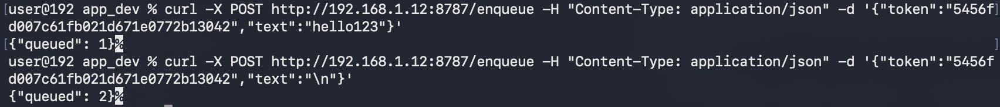

## platform-feature-05-risk-02

### Description

Because the iOS platform provides Custom Keyboard feature, your application is at risk of an attacker sending remote input through a malicious third-party keyboard connected to a command server.

### Goal

As a result, this could lead to **_Command and Control_** - attackers remotely controlling input sent through the custom keyboard.

### Demonstration

Set up a physical iOS device and macOS workstation with the following configuration:

| Configuration | Detail |
| -------- | ------- |
| Prerequisite | platform-feature-05 |
| Malicious App | `keylogger_server.zip` |
| Additional Requirement | User must add the custom keyboard and enable **Full Access** |
| Network Requirement | iOS device and macOS workstation must be on the same network |

Perform the following steps to demonstrate the risk of an attacker sending remote input through a malicious third-party keyboard connected to a command server:

1. Start the server on the macOS workstation to ensure that the iOS device can connect to the same network as the macOS workstation.
2. Install and launch the test application on the iOS device to call the `/pair` API. If the server is reachable on the same network, the server returns a token to the application and pairs with it automatically.
3. Open **Settings > General > Keyboard > Keyboards > Add New Keyboard** to add the custom keyboard from the test application and enable **Full Access**.
4. Use the custom keyboard in a text field to log the keystrokes entered by the user. Each keystroke is inserted into the focused text field and also stored in the shared event log.
5. Send remote keystrokes from the server using `curl` commands to queue the keystrokes until the custom keyboard is opened on the iOS device.

6. Open the custom keyboard on the iOS device to poll the `/next` API for queued input. If there are items in the queue, the keyboard automatically executes the queued keystrokes in the focused text field.

> **Important Note:**
> For `RETURN`, queue `\n` separately for it to work as a **Go/Search** action. If `\n` is queued together with the payload, it will be treated as an empty space character.
>
> Example:
> `"hello123\n"` becomes `"hello123 "`
> `"hello123"` + `"\n"` becomes `"hello123"` + **Go/Search**

Feature-05-Risk-02 control measures:

- [platform-feature-05-risk-02-control-01](platform-feature-05-risk-02-control-01.md)
- [platform-feature-05-risk-02-control-02](platform-feature-05-risk-02-control-02.md)
