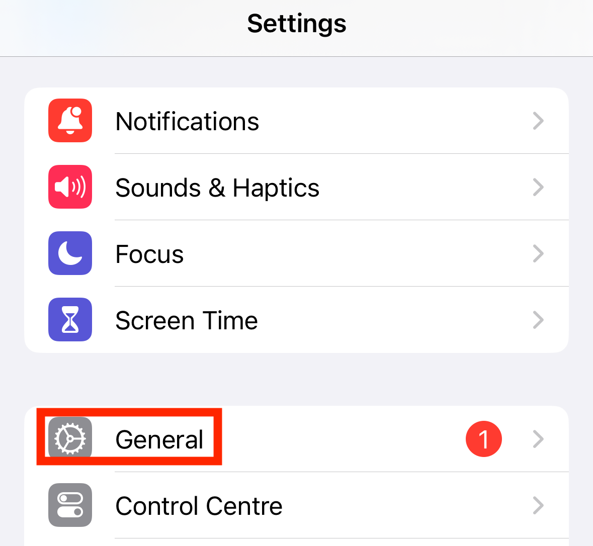
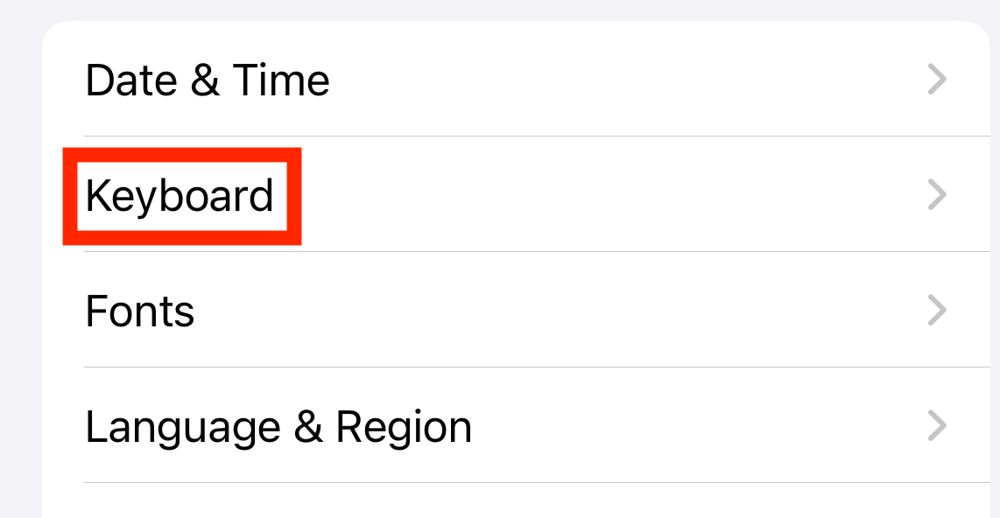
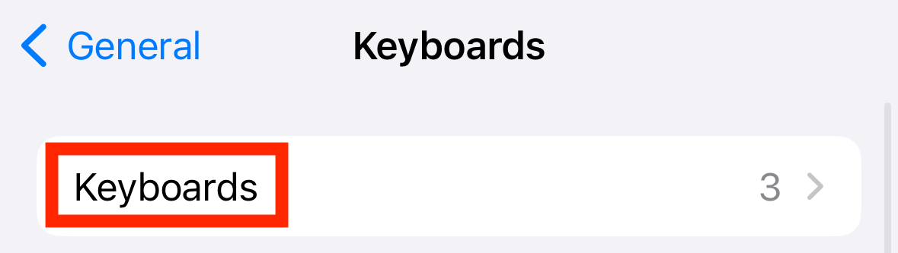
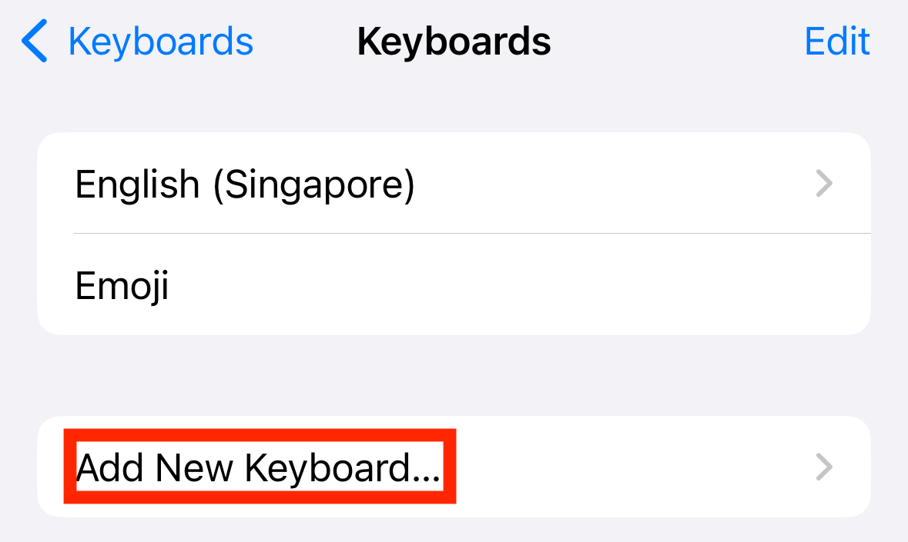
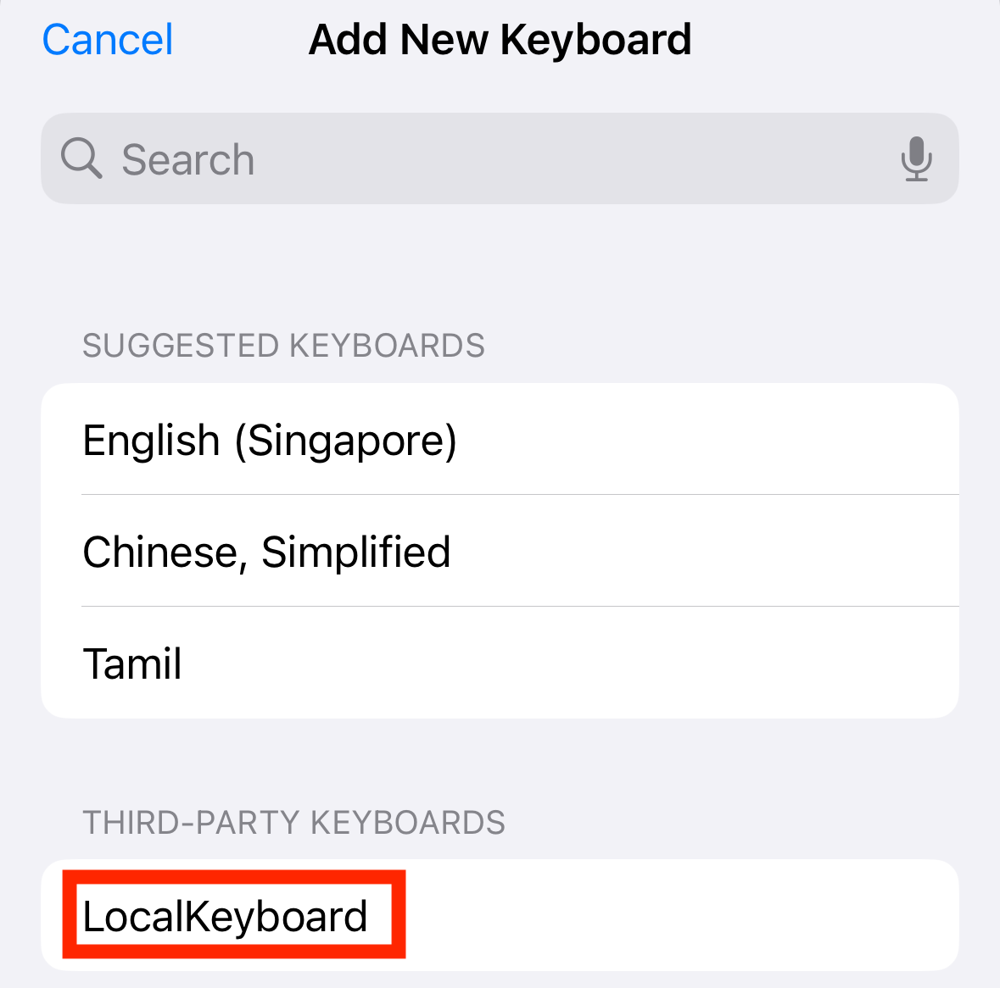
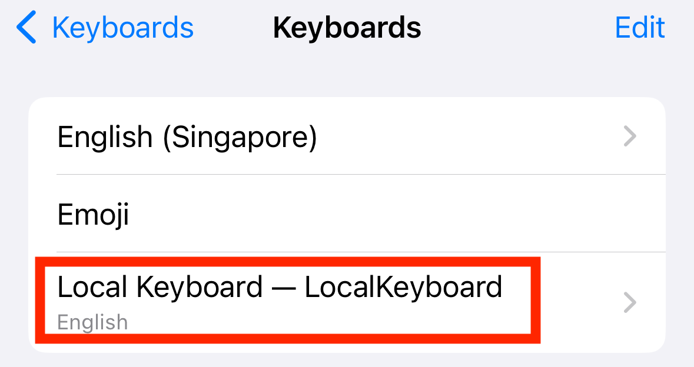
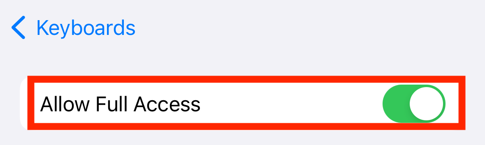

## platform-feature-05

### Description

The iOS platform provides Custom Keyboard feature.

### Additional context

Custom Keyboard is a feature that allows users to install and use third-party keyboards from an app, select them for text input across supported apps, and grant additional access when Allow Full Access is enabled.

### Demonstration

Set up a physical iOS device with the following configuration:

| Configuration | Detail                        |
| ------------- | ----------------------------- |
| Device Model  | iPhone 15                     |
| iOS Version   | 17.6                          |
| Device State  | Non-Jailbroken                |
| Apps Used     | `feature5-local_keyboard.zip` |

Perform the following steps to enable Custom Keyboard:

1. Download and install the app to provide the custom keyboard.

2. Open **Settings** and go to **General** to access keyboard settings (screenshot 1). Select **Keyboard** to view keyboard options (screenshot 2). Select **Keyboards** to view installed keyboards (screenshot 3). Select **Add New Keyboard** to add another keyboard (screenshot 4). Under **Third-Party Keyboards**, select the custom keyboard from the app to add it (screenshot 5).

3. Select the newly added keyboard to open its settings (screenshot 6). Enable **Allow Full Access** for the third-party keyboard to grant additional keyboard access (screenshot 7).

Because the iOS platform provides Custom Keyboard feature, your app is at risk of:

- [platform-feature-05-risk-01](platform-feature-05-risk-01.md)
- [platform-feature-05-risk-02](platform-feature-05-risk-02.md)
